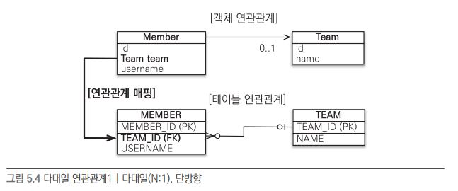
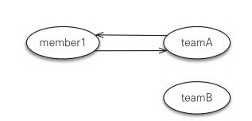
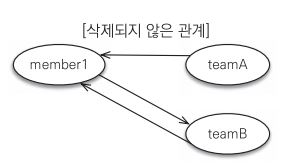
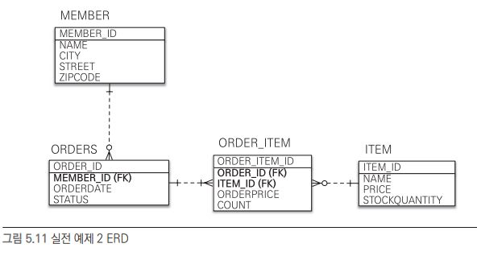
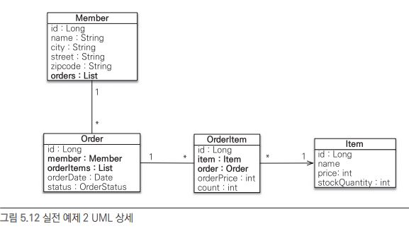
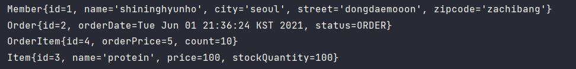

# 연관관계 매핑 기초

객체의 참조와 테이블의 외래키를 이용한 관계는 다르다는걸 앞장 예제에서 살펴봤다.

이번장에서는 객체의 참조와 테이블의 외래 키를 매핑하는것이다.


핵심 키워드

- 방향

  - 단방향 : 회원 -> 팀 처럼 한쪽만 참조하는것, 객체관계에서만 존재
  - 양방향 : 회원 -> 팀, 팀 -> 회원 처럼 서로 참조하는것. 테이블 관계는 항상 양방향관계.

- 다중성 

  1:N, N:1 N:M 처럼 포함관계를 나타냄. 한 팀에 여러 회원이 있으면 팀과 회원은 1:N 관계

- 연관관계의 주인

  객체를 양방향 연관관계로 만들면 연관관계의 주인을 정해야함.


## 단방향 연관관계

객체는 참조를 통해 다른 객체에 접근한다. member 객체에서 team 객체에 접근하려면 Member.team같은 객체로 접근해야한다. (단방향)

반면 테이블은 외래키(MEMBER.TEAM_ID)를 가지고 조인을 통해 다른 테이블에 접근한다.(양방향)



그래서 다른 객체를 참조하기 위해 Member.team과 MEMBER.TEAM_ID 를 매핑해야한다.

이를 연관관계 매핑이라고 한다.

```
@ManyToOne
@JoinColumn(name="TEAM_ID")
private Team team;
```

### @ManyToOne

다대일(N:1) 관계라는 매핑 정보다. 연관관계를 맺을때 다중성을 나타내는 어노테이션은 필수다.

### @JoinColumn

조인 컬럼은 외래 키를 매핑할때 사용하는데 name 속성으로 매핑할 외래 키 이름을 지정한다. 상대방에 외래키 이름을 지정하는 것이다.

이 어노테이션은 생략이 가능한데 그러면 외래키를

- 필드명+_+참조하는 테이블의 컬럼명

같이 설정한다.


다음과 같이 정의한다면

```
@ManyToOne
private Team team; // 필드명
```

team_TEAM_ID (필드명_참조하는 테이블의 컬럼명)으로 외래키를 설정한다.

> 즉 주인일때 JoinColumn을 사용하는군


## 연관관계 사용

### 저장

맴버가 팀을 참조해주면 된다. 이후 맴버도 영속 상태로 만들어준다.

```
Team team1 = new Team();
em.persist(team1);

Member member1 = new Member();
member1.setTeam(team1);
em.persist(member1);

Member member2 = new Member();
member2.setTeam(team1);
em.persist(member2);
```


### 조회

조회는 객체 그래프 탐색(객체 연관관계를 사용한 조회)와 객체지향 쿼리(JPQL) 사용이 있다.

- 객체 그래프 탐색

  member.getTeam()을 사용해 member와 연관된 team 엔티티를 조회하는 방법.

  ```
  Member member = em.find(Member.class,"member1");
  Team team = member.getTeam(); // 객체 그래프 탐색
  ```

- 객체지향 쿼리 사용 (JPQL)

  JPQL도 조인을 사용할 수가 있다.

  ```
  select m from Member m join m.team t
  where t.name=:teamName
  ```

  (:로 시작하는것은 파라미터틀 바인딩받는 문법)

  SQL로는 다음과 같이 실행된다.

  ```
  SELECT M.* FROM MEMBER MEMBER
  INNER JOIN
  	TEAM TEAM ON MEMBER.TEAM_ID = TEAM1_.ID
  WHERE
  	TEAM1_.NAME='팀1'
  ```


### 수정

엔티티를 단순히 수정해주면 더티 체킹으로 알아서 UPDATE 문을 날려준다.

```
Member member = em.find(Member.class,"member1");
member.setTeam(team2);
```


### 연관관계 제거

null로 변경해준다.

```
Member member = em.find(Member.class,"member1");
member.setTeam(null);
```


### 연관관계 삭제

연관된 엔티티를 삭제하려면 외래 키 제약조건에 위배되지 않게 먼저 연관관계를 제거해야한다.

```
member1.setTeam(null);
member2.setTeam(null);
em.remove(team);
```

 

## 양방향 연관관계

객체 관계는 단방향만 있기에 단방향을 두개사용해 양방향처럼 사용한다.

위에 예제에서는 맴버에서 팀으로만 접근했는데 팀에서 맴버로 접근하려면 양방향 관계를 가져야한다.

팀은 맴버와 일대다 관계이기 때문에 여러건의 맴버와 관계를 맺기 위해서 컬렉션을 사용한다.


```
// Team 클래스
@OneToMany(mappedBy = "team")
private List<Member> members = new ArrayList<Member>();
```

팀에서 맴버와 매핑할때 일대다 관계이기 때문에 @OneToMany를 사용했다. mappedBy 속성은 양방향 매핑일 때 사용하는데 반대쪽 매핑 필드 이름을 넣어주면 된다.


조회도 이제 팀에서 맴버로 가능하다. 

```
Team team = em.find(Team.class,"team1");
List<Member> members = team.getMembers(); // 팀 -> 회원
```


## 연관관계의 주인

테이블은 외래 키 하나로 두 테이블의 연관관계를 관리한다.

엔티티를 단방향으로 매핑하면 참조를 하나만 사용하므로 객체는 서로를 참조하도록한다. 그러면 객체의 연관관계를 관리하는 포인트는 2곳이 된다.

따라서 엔티티를 양방향 연관관계로 설정하면 객체의 참조는 둘인데 외래 키는 하나다. 차이가 발생하는 것이다.

이러한 두 객체 연관관계 중 하나를 정해 테이블의 외래키를 관리해야하는데 이를 연관관계의 주인이라 한다.

> mappedBy를 가지면 주인이 아니구나

### 양방향 매핑의 규칙

연관관계의 주인은 데이터베이스 연관관계와 매핑되고 외래 키를 관리(등록, 수정, 삭제) 할 수 있다. 반면 주인이 아닌쪽은 읽기만 가능하다. 주인은 mappedBy 속성을 사용하지 않고 주인이 아니면 mappedBy 속성을 사용해 속성의 값으로 주인을 지정한다.


>  그럼 어떤 기준으로 주인을 정할까?


연관관계의 주인을 정한다는건 외래 키 관리자를 선택하는 것이다. 그래서 외래 키가 있는 곳을 주인으로 정한다.(외래 키가 없는곳으로 정하면 외래 키가 있는곳을 또 조회해야한다.)

데이터베이스 테이블의 다대일, 일대다 관계에서는 항상 다 쪽이 외래키를 가져 주인이 된다.


## 양방향 연관관계 저장

주인이 정해졌으니 주인에 의해서만 관계가 저장된다. 어찌보면 당연하다 주인이 외래키를 관리하기 떄문이다.


다음과 같이 주인이 아닌 객체에만 저장하려고하면 무시된다.

```
team1.getMembers().add(member1)
```


반대로 연관관계 설정은 주인만 한다.

```
member1.setTeam(team1);
member2.setTeam(team1);
```


### 순수한 객체까지 고려한 양방향 연관관계

JPA가 아닌 순수한 객체에서는 주인 객체에 연관관계를 설정해도 반대객체(주인이 아닌)에서 접근하려고 하면 접근할 수가 없다.

```
member1.setTeam(team1);

List<Member> members = team1.getMembers(); // 빈 리스트
```


그래서 이러한 문제를 해결하기 위해 양쪽 모두 관계를 설정해준다.

```
// 연관관계의 주인
member1.setTeam(team1); // 연관관계 member1 -> team1
// 주인이 아니기에 저장되지 않음
team1.getMembers().add(member1); // 연관관계 team1 -> member1
```

이렇게 설정하면 JPA, 순수객체 모두 정상적으로 동작한다.


- Member.team : 연관관계의 주인, 이 값으로 외래 키를 관리
- Team.members : 연관관계의 주인이 아님. 저장시에는 사용되지 않음.


> 그러면 양방향 관계에서는 양쪽 모두 관계를 맺어주는게 맞겠다.


### 연관관계 편의 메소드

양방향 연관관계시 어차피 둘다 연관관계를 맺어야한다면 한 메소드에 넣어주면 될것이다.

```
// Member 클래스
public void setTeam(Team team){
	this.team = team;
	team.getMembers().add(this);
}
```

그러면 양방향을 신경써주지 않아도 된다.


#### 연관관계 편의 메소드 주의 사항

다음처럼 맴버1이 팀A와 양방향 관계를 맺으면 다음과 같다.




그러면 맴버1이 팀B와 새로운 관계를 맺으면 어떻게 될까.


팀B와 정상적으로 연관관계를 맺으나 팀A는 여전히 맴버1을 바라보고있다.




그래서 연관관계를 맺을때 이전 관계를 제거해줘야한다.

```
public void setTeam(Team team){
	// 기존 관계 제거
	if (this.team != null){
		this.team.getMembers().remove(this);
	}
	// 새로운 관계
	this.team = team;
	team.getMembers().add(this);
}
```

다만 맴버1이 주인이기 때문에 실제 DB에 저장할때는 문제가 되진 않는다. 문제는 팀A이 영속성 컨텍스트에 남아있다면 팀A에 맴버 호출시 맴버1이 호출된다.


이처럼 관계형 데이터베이스에서는 외래키 하나만으로 해결할 수 있지만 객체에서는 단방향 연관관계 2개를 양방향처럼 보이기 위해 많은 수고가 따른다.


> 양방향 관계는 결국 단방향 관계에서 주인이 아닌 객체가 참조할 수 있는 기능을 추가해준 것이다.


## 연관관계의 주인을 정하는 규칙

- 단방향은 항상 외래 키가 있는 곳을 기준으로 매핑하면 된다.
- 양방향에서는 다 쪽을 주인으로 선택한다.
- 연관관계의 주인은 외래 키의 위치와 관련해서 정해야지 비즈니스 중요도로 접근하면 안된다.


## 실전 예제

이전 장에서는 객체 참조를 사용하지 않고 테이블 구조를 따라 엔티티를 설정했다.(외래 키 사용)

이번에는 연관관계를 매핑을 통해 설정을 바꿔준다.


ERD는 이전과 동일하다(테이블 구조이기 때문에)




UML만  바뀐다.




### 결과

연관관계를 표기하니 객체를 통해 호출할 수 있었다.

간단한 결과


자세한 결과




연관관계 주입 소스

```
Member member = new Member();
member.setName("shininghyunho");
member.setCity("seoul");
member.setStreet("dongdaemooon");
member.setZipcode("zachibang");
em.persist(member);

Order order = new Order();
order.setStatus(OrderStatus.ORDER);
order.setOrderDate(new Date());
order.setMember(member); // member 관계매핑
em.persist(order);

Item item = new Item();
item.setName("protein");
item.setPrice(100);
item.setStockQuantity(100);
em.persist(item);

OrderItem orderItem = new OrderItem();
orderItem.setCount(10);
orderItem.setOrderPrice(5);
orderItem.setOrder(order); // order 관계매핑
orderItem.setItem(item); // item 관계매핑
em.persist(orderItem);
```


연관관계 매핑을 직접 해보니 규칙성이 보였다.

```
// 관계 owner
@ManyToOne
@JoinColumn(name = "MEMBER_ID") // 외래키 이름
private Member member;

// 관계 inverse
@OneToMany(mappedBy = "order") // 주인이 정한 필드명
List<OrderItem> orderItems = new ArrayList<OrderItem>();
```

관계 owner는 다의 관계고 조인컬럼(fk)을 사용하고

관계 inverse는 일의 관계고 mappedBy 속성으로 owner의 필드명에 의해 map된다는걸 명시해준다. 
