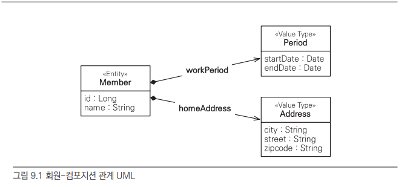
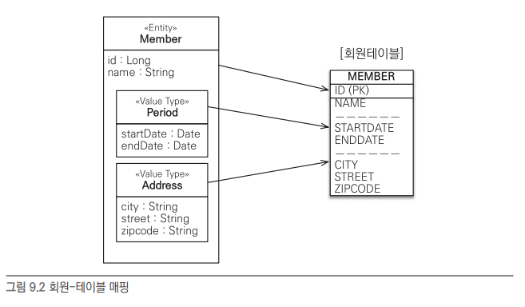
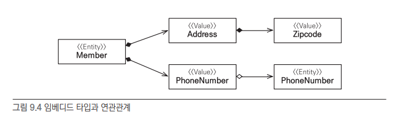
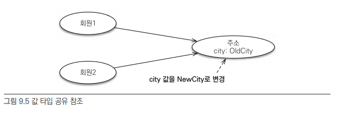
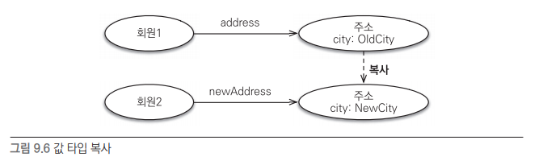
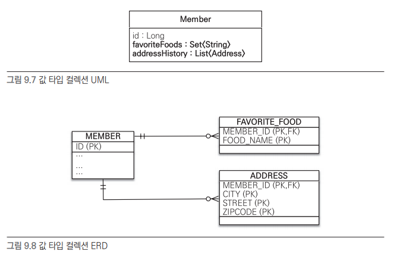
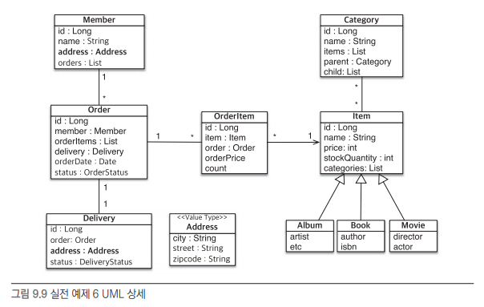
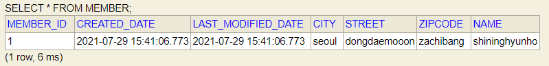

# 9 값 타입

JPA에서 데이터 타입은 엔티티 타입과 값 타입으로 나뉜다.

엔티티 타입은 @Entity로 정의한 객체이고 값 타입은 식별자가 없는 숫자나 문자를 말한다.

엔티티는 내용을 바꾸어도 식별자가 존재해 추적할 수 있지만 값 타입은 내용이 바뀌면 완전히 다른값으로 바뀐다.


값 타입의 3종류

- 기본값 타입
  - 자바 기본 타입(int, double)
  - 래퍼 클래스(Integer)
  - String
- 임베디드 타입(복합 값 타입, JPA에서 사용자가 직접 정의한 타입)
- 컬렉션 값 타입
- 

## 기본 값 타입

```
@Entity
public class Member{
	@Id @GeneratedValue
	private Long id;
	
	// 기본 값 타입
	private String name;
	private int age;
}
```

Member 엔티티는 id라는 식별자도 존재하고 생명주기도 있지만 name, age는 식별자도 없고 생명주기도 엔티티에 의존하게 된다.


## 임베디드 타입(복합 값 타입)

기본 값을 여러개 묶어 새로운 데이터 타입이 필요할 때가 있는데 이를 JPA에서 임베디드 타입이라고 한다.


예를 들어 Member 엔티티에 근무기간, 집주소를 임베디드 타입으로 정한다고 해보자.

```
@Entity
public class Member{
	@Id @GeneratedValue
	private Long id;
	private String name;
	
	@Embedded Period workPeriod;
	@Embedded Address homeAddress;
}

@Embeddable
public class Period{
	@Temporal(TemporalType.DATE) java.util.Date startDate;
	@Temporal(TemporalType.DATE) java.util.Date endDate;
	
	// 값 타입을 위한 메소드를 정의할 수도 있다.
	public boolean isWork(Date date){
		...
	}
}

@Embeddable
public class Address{
	@Column(name="city") // 매핑할 컬럼 정의 가능
	private String city;
	private String street;
	private String zipcode;
}
```

필요한 타입들을 묶어서 정의해주면 재사용하기도 쉽고 응집도도 올라간다.



임베디드 타입은 생성자가 필수고

임베디드 타입은 엔티티 생명주기에 의존하므로 UML로 표현하면 컴포지션 관계다.

(하이버네이트에서는 임베디드 타입을 컴포넌트(components)라고 한다.)


### 임베디드 타입과 테이블 매핑

임베디드 타입을 테이블과 매핑하면 테이블에 사용전과 차이는 없다.



다만 임베디드 타입 덕분에 객체와 테이블에 세밀한(fine-grained) 매핑이 가능해진다.

잘 설계한 ORM 애플리케이션에서는 매핑한 테이블 수보다 클래스 수가 더 많아지게 된다.


### 임베디드 타입과 연관관계

임베디드 타입은 값 타입을 포함하거나 엔티티를 참조할 수 있다.



```
@Entity
public class Member{
	@Embedded Address address; // 임베디드 타입
	@Embedded PhoneNumber phoneNumber; // 임베디드 타입
}

@Embeddable
public class Address{
	...
	@Embedded Zipcode zipcode; // 임베디드 타입 속 임베디드 타입
}

@Embeddable
public class Zipcode{
	String zip; String plusFour;
}

@Embeddable
pbulic class PhoneNumber{
	String areaCode; String lcoalNumber;
	@ManyToOne PhoneServiceProvider provider // 임베디드 타입 속 엔티티 참조
}

@Entity
public class PhoneServiceProvider{
	@Id String name;
	...
}
```


### @AttributeOverride: 속성 재정의

만약 정의되어 있는 임베디드 타입을 바꿔 사용하고 싶다면 어떻게 할까?

그때는 @AttributeOverride 속성을 사용하면 된다.

```
@Entity
public class Member{
	...
	@Embedded
	@AttributeOverrides({
		@AttributeOverride(name="city",column=@Column(name="COMPANY_CITY")),
		@AttributeOverride(name="street",column=@Column(name="COMPANY_STREET")),
		...
	})
	Address companyAddress;
}
```

이런식으로 바꿔주면 테이블도 이에따라 새롭게 생성된다.

코드가 좀 많이 지져분해지는데 다행이도 이를 쓸일이 많이 없다.

### 임베디드 타입과 null

임베디드 타입이 null이면 매핑한 컬럼 값은 모두 null이 된다.

```
member.setAddress(null); // 임베디드 타입 null 설정
em.persist(member);
```

연관되어있던 CITY, STREET, ZIPCODE 컬럼 값이 모두 null이 된다.


## 값 타입과 불변 객체

값 타입은 객체를 단순화하기 위해 만든 개념이므로 단순하고 안전하게 다뤄야한다.

### 값 타입 공유 참조



다음과 같이 같은 임베디드 타입을 공유하면 임베디드 타입 변경시 참조하고 있던 모든 엔티티의 값이 변경되어 회원 1과 회원 2에 모두 UPDATE 쿼리가 발생한다. 이를 막기위해서는 값을 복사해서 사용해야한다.

### 값 타입 복사



값 타입을 복사해서 참조하게되면 둘은 완전히 다른 객체를 참조하게 되어 문제가 생기지 않는다.

자바의 기본 타입은 단순히 복사만 해줘도 독립적인 값을 가지게 된다.

```
int a=10
int b=a;
b=4
```

하지만 임베디드 타입은 기본 타입이 아니므로 항상 복사해줘서 넘겨줘야 문제가 생기지 않는다. 또 다른 방법으로는 기존 엔티티의 속성값을 변경하지 못하게 set함수를 만들어 두지 않는것도 방법이다.

### 불변 객체

위에서 말했던 객체를 참조했을때 원본이 훼손되는 경우를 막기위해서는 객체를 변경할수 없도록 만들면된다. 이를 불변 객체라고 하는데, 가장 쉬운 방법은 생성자로만 값을 설정하게하고 이후 수정자는 만들지 않는것이다.

```
@Embeddable
public class Address{
	private String city;
	protected Address(){} // JPA에서 기본 생성자는 필수다.
	public Address(String city) {this.city=city;} // 생성자로만 설정
    public String getCity(){return city;} // 접근자만 노출
    // 수정자는 만들지 않음.
}
```

이와 같은 방법으로 값 타입을 공유한다고해서 부작용이 발생하지 않게된다. 만약 수정이 필요하다면 새롭게 만들면 된다. Integer, String은 자바가 기본적으로 제공하는 대표적인 불변 객체다.

## 값 타입의 비교

자바의 객체 비교는 2가지가 있다.

- 동일성(Identity) 비교 : 인스턴스의 참조 값을 비교, == 사용.(완전히 같은 객체)
- 동등성(Equivalence) 비교 : 인스턴스의 값을 비교, equals() 사용.(내용물이 같은 객체)

값 타입은 기본적으로 동등성 비교를 해야한다. 내용물이 같으면 같은 객체로 봐야하는것이다.

그렇다면 equals()를 쓰면 되는데 재정의해서 사용해야한다. (equals()를 수정한다면 hashCode()도 수정해줘야 컬렉션(HashSet, HashMap)이 정상적으로 동작한다.)

## 값 타입 컬렉션

값 타입을 하나 이상 저장하려면 컬렉션에 보관하고 @ElementCollection, @CollectionTable 어노테이션을 사용하면 된다.

```
@Entity
public class Member{
	@Id @GeneratedValue
	private Long id;
	
	@Embedded
	private Address homeAddress; // 임베디드 타입
	
	@ElememtCollection
	@CollectionTable(name="FAVORITE_FOODS",joinColumns=@JoinColumn(name="MEMBER_ID"))
	@Column(name="FOOD_NAME")
	private Set<String> favoriteFoods = new HashSet<String>();
	
	@ElementCollection
	@CollectionTable(name="ADDRESS",joinColumns=@JoinColumn(name="MEMBER_ID"))
	private List<Address> addressHistory = new ArrayList<Address>();
}

@Embeddable
public class Address{
	@Column
	private String city; private String street; private String zipcode;
}
```

문제는 관계형 데이터베이스에서는 컬렉션을 컬럼으로 가질 수 없다. 그래서 추가로 테이블을 할당해준다. 

하나씩 분석해보면 @ElemenCollection은 값타입으로 컬렉션을 사용하겠다는 의미고

@CollectionTable은 해당 컬렉션을 위한 테이블을 생성해주겠다는 의미다.

컬렉션에 해당하는 테이블에 맴버가 여러개면 Address처럼 따로 임베디드 값 타입을 지정해줘야하지만 맴버가 하나라면 간단하게 @Column으로 표기할수도 있다.



### 값 타입 컬렉션 사용

```
Member member = new Member();

// 임베디드 값 타입
member.setHomeAddress(new Address("인천","연수구","123"));

// 기본값 타입 컬렉션
member.getFavoriteFoods().add("짜장");
member.getFavoriteFoods().add("짬뽕");
member.getFavoriteFoods().add("탕수육");

// 임베디드 값 타입 컬렉션
member.getAddressHistory().add(new Address("서울","강남","456"));
member.getAddressHistory().add(new Address("서울","강북","789"));

em.persist(member);
```

위 예제에서 member 엔티티 하나만 영속화해주면 모두 등록이 된다.

그렇다면 SQL 쿼리는 몇번 일어날까?

먼저 임베디드 값 타입은 Member 안에 표기되므로 Member 를 등록할때 같이 등록된다. 1번

기본값 타입 컬렉션은 Favorite_food 테이블에 하나씩 추가되므로 3번

임베디드 값 타입 컬렉션도 Address_history 테이블에 임베디드값이 한번씩 추가되므로 2번

이렇게 총 6번의 INSERT문이 실행된다.


값 타입 컬렉션의 페치 전략은 기본적으로 LAZY다. 그래서 Member를 가져와도 Favorite_food와 Address_history는 실제로 조히할때 쿼리로 가져오게 된다.


또한 수정할때는 값 타입은 불변하므로 항상 삭제하고 새롭게 생성해줘야한다. 


### 값 타입 컬렉션의 제약사항

값 타입 컬렉션에는 치명적인 단점이 있다. 변경이 매우 비효적이라는 것이다.

엔티티는 식별자가 존재해 엔티티의 값을 변경해도 식별자를 통해 DB에 저장된 원본 데이터를 쉽게 찾아서 변경할 수 있다. 하지만 값 타입의 컬렉션은 단순히 값들의 모임이므로 식별자가 존재하지 않는다. (예를 들어 addres를 "서울","동대문","789"라고 변경한다면 DB에서는 식별자가 없어 어떤 low를 변경할지 모른다는 이야기다.)

그래서 값 타입 컬렉션을 변경하려면 해당 컬렉션의 값들을 모두 삭제하고 새롭게 다 넣어줘야한다.  매핑한 테이블에 데이터가 많다면 쓰기에 부적절하다.

대신 새로운 엔티티를 만들고 일대다 관계를 사용할 수 있다. 여기에 영속성 전이(Cascade) + 고아 객체 제거(ORPHAN REMOVE) 기능을 적용하면 값 타입처럼 사용 가능하다.

```
@Entity
public class AddressEntity{
	@Id @GeneratedValue
	private Long id;
	
	@Embedded Address address;
	...
}
```


설정은 다음과 같이 하면된다.

```
@OneToMany(cascade=CascadeType.ALL,orphanRemoval=true)
@JoinColumn(name="MEMBER_ID")
private List<AddressEntity> addressHistory = new ArrayList<AddressEnity>();
```


## 정리

엔티티 타입과 값 타입은 다음과 같은 특징이 존재한다.


엔티티 타입의 특징

- 식별자(@Id)가 존재한다.
- 생명 주기가 있다.
  - em.persist로 영속화하고 em.remove로 제거한다.
- 공유할 수 있다.
  - 참조값을 공유할 수 있는데 이를 공유 참조라 한다.
  - 회원 에티티를 만들면 다른 엔티티에서 회원 엔티티를 참조할 수 있는것이다.

값 타입의 특징

- 식별자가 없다.
- 생명 주기를 엔티티에 의존한다.
- 공유하지 않는것이 안전하다.
  - 공유하고 변경하면 원본도 같이 변경된다.
  - 불변 객체로 만들어 관리하는것이 안전하다.


값 타입은 엔티티와 다르다. 그래서 혼동해서 사용하면 안된다.

**식별자가 필요하고 지속해서 값을 추적하고 구분하고 변경해야한다면 값타입이 아닌 엔티티다.**


# 실전 예제



기존 Address 내용들을 각각 엔티티에 적어주었는데 이를 임베디드 값 타입으로 변경하여 저장해보는 예제다.

책에 나와있던대로 임베디드 타입만 적절히 변경해주면 되었다.

단 임베디드 타입은 독자적인 타입을 가지므로 equals와 hashCode를 재정의 해주어야했다.

```java
@Override
public boolean equals(Object o){
    if(this==o) return true;
    if(!(o instanceof Address)) return false;

	Address address = (Address) o;
    if(city!=null ? !city.equals(address.city) : address.city!=null) return false;
    if(street!=null ? !street.equals(address.street) : address.street!=null) return false;
    if(zipcode!=null ? !zipcode.equals(address.zipcode) : address.zipcode!=null) return false;

    return true;
}

@Override
public int hashCode(){
    int result=city!=null ? city.hashCode() : 0;
    result=31*result+(street!=null?street.hashCode():0);
    result=31*result+(zipcode!=null?zipcode.hashCode():0);
    return result;
}
```


임베디드 타입 자체가 개념적인 분리이기에 실제 테이블에서의 변경사항은 없다. 



