# 고급 매핑

## 상속 관계 매핑(테이블 설계)

관계형 데이터베이스에서는 객체지향 언어에서의 상속 개념이 없다.

대신 관계형 데이터베이스에서는 슈퍼타입 서브타입 관계라는 모델링 기법이 상속과 유사하다.

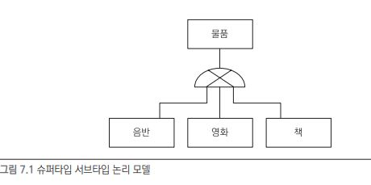


ORM에서 이야기하는 상속 관계 매핑은 객체의 상속 구조와 데이터베이스의 슈퍼타입 서브타입 관계를 매핑하는 것이다.

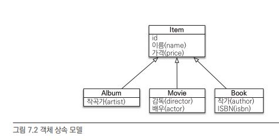


슈퍼타입 서브타입 논리 모델을 실제 물리 모델인 테이블로 구현할때는 3가지 방법이 있다.

- 각각 테이블로 변환 : 각각 테이블을 만들고 조회할때 조인한다. JPA에서 조인 전략이라고 함.
- 통합 테이블로 변환 : 테이블을 하나만 사용해서 통합. JPA에서 단일 테이블 전략이라고 함.
- 서브타입 테이블로 변환 :  서브 타입마다 하나의 테이블로 만듦. JPA에서 구현 클래스마다 테이블 전략이라고 함.


### 조인 전략

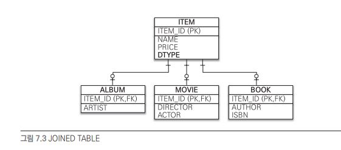

엔티티마다 모두 테이블로 만들어주고 부모의 기본키를 기본키 + 외래키로 사용함. 그래서 조회할때 조인을 사용함. 다만 객체는 타입이 있는데 테이블은 타입에 개념이 없으니 따로 컬럼을 추가해줘야함. ex) DTYPE


```
// Item 엔티티
@Entity
@Inheritance(strategy = InheritanceType.JOINED)
@DiscriminatorColumn(name = "DTYPE")
public abstract class Item{
	@Id @GeneratedValue
	@Column(name = "ITEM_ID")
	private Long id;
	
	private String name;
	private int price;
	
	...
}

// Album 엔티티
@Entity
@DiscriminatorValue("A")
public class Album extends Item{
	private String artist;
	...
}

// Movie 엔티티
@Entity
@DiscriminatorValue("M")
public class Movie extends Item{
	private String director;
	private String actor;
	...
}
```

Item 엔티티에서 상속 매핑을 한다고 지정하고(@Inheritance) 전략으로 조인전략을 사용한다고 지정한다.(Inheritance.JOINED)

그리고 구분 부모에서 구분 컬럼을 지정한다. 그러면 부모 테이블에 DTYPE 이름으로 컬럼이 생성된다.

자식들은 구분 칼럼에 어떻게 저장되는지 작성한다 Album 엔티티는 부모에게 DTYPE에 A라는 값으로 저장된다.


자식 엔티티에는 Id가 없는데 부모 테이블에 Id를 자식 테이블에서 그대로 사용한다. 만약 자식 테이블 기본키 컬럼명을 따로 설정하려면 @PrimaryKeyJoinColumn을 사용한다.

```
// Book 엔티티
@Entity
@DiscriminatorValue("B")
@PrimaryKeyJoinColumn(name = "BOOK_ID")
...
```

그러면 Book 테이블에 아이디 컬럼명은 ITEM_ID에서 BOOK_ID가 된다.


- 장점
  - 테이블이 정규화 됨.
  - 외래 키 참조 무결성 제약조건을 활용할 수 있음.
  - 저장공간을 효율적으로 사용.

- 단점
  - 조회할때 조인이 많아 성능 저하.
  - 조회 쿼리가 복잡.(조인때매)
  - 테이블을 등록할 때 INSERT SQL을 두 번 실행해야함.
- 특징
  - JPA 표준 명세는 구분 컬럼을 사용하도록 하지만 하이버네이트를 포함한 몇 구현체는 구분 칼럼없이도 동작함.
  - 관련 어노테이션
    - @PrimaryKeyJoinColumn, @DiscriminatorColumn, @DiscriminatorValue


### 단일 테이블 전략

이름에서 알 수 있듯이 테이블을 하나만 쓰는것이다. 구분 컬럼(DTYPE)을 통해 어떤 자식 테이터가 저장되어있는지 알 수 있다.테이블이 하나라서 조인을 쓰지 않아 가장 빠르다.

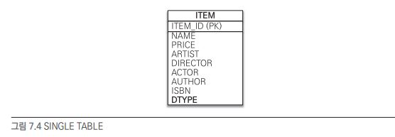

이 전략의 특징은 자식들을 모두 하나의 테이블로 만들었기 때문에 자식들마다 컬럼이 달라 null 값이 굉장히 많다. ex) Book 엔티티에는 ACTOR 컬럼을 쓰지 않아 null 이다.

```
// Item 엔티티
@Entity
@Inheritance(strategy = InheritanceType.SINGLE_TABLE)
@DisciminatorColumn(name = "DTYPE")
...

// 자식 엔티티
@Entity
@DiscriminatorValue("A")
...

@Entity
@DiscriminatorValue("M")
...
```


조인전략과 형식은 비슷한데 Inheritance.SINGLE_TABLE을 사용한다. 또한 모든 테이블이 하나로 통합되어있기 때문에 구분 컬럼은 필수다.

- 장점
  - 조인이 필요없어 일반적으로 조회 성능이 빠르다.
  - 조회 쿼리가 단순하다.
- 단점
  - 자식 엔티티가 매핑한 컬럼은 모두 null을 허용해야한다.
  - 모든것을 저장하는게 단일 테이블이니 테이블이 크다. 상황에 따라 조회 성능이 오히려 느려질 수 있다.(컬럼이 많으니) 
- 특징
  - 구분 컬럼이 필수다.(@DiscriminatorColumn)
  - 구분 컬럼 값(@DiscriminatorValue)을 지정하지 않으면 엔티티 이름을 그대로 사용한다.(Move, Album)


### 구현 클래스마다 테이블 전략

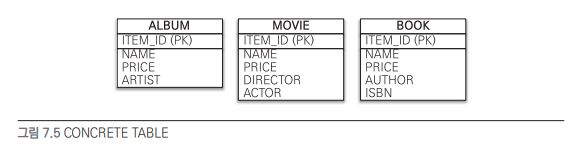

자식 테이블이 부모 테이블의 모든것을 다 가지고 있는 형태다. 그래서 자식 엔티티마다 테이블을 다 만들어 준다.


```
// Item 엔티티
@Entity
@Inheritance(strategy = InheritanceType.TABLE_PER_CLASS)
...

// 자식 엔티티
@Entity
@DiscriminatorValue("A")
...

@Entity
@DiscriminatorValue("M")
...
```

InheritanceType.TABLE_PER_CLASS 속성을 지정해주면 된다.

그러면 구현 클래스마다 테이블 전략을 사용한다. 일반적으로 사용하지 않는다.


- 장점
  - 서브 타입을 구분해서 처리할 떄 효과적.
  - not null 제약조건을 사용할 수 있다.(본인것만 있기에)
- 단점
  - 여러 자식 테이블을 함께 조회할때 성능이 느리다.(SQL에 UNION을 사용.)
  - 자식 테이블을 통합해서 쿼리하기 힘듦.
- 특징
  - 구분 컬럼을 사용하지 않음.


상속 개념이 없어져버려 데이터베이스 설계자나 ORM 전문가 모두 선호하지 않는다.


## @MappedSuperclass

위 방법들은 모두 부모 자식 클래스 모두 데이터베이스 테이블과 매핑했는데, 

부모 클래스는 테이블과 매핑하지 않고 부모 클래스를 자식 클래스에게 매핑 정보만 제공하고 싶을때 @MappedSuperclass를 사용한다.

@MappedSuperclass는 추상 클래스와 비슷한데 @Entity는 실제 테이블과 매핑되지만 이는 그렇지 않다. 단순히 매핑 정보를 상속할 목적으로만 사용된다.


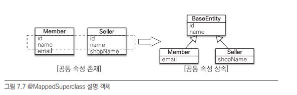

Member 테이블과 Seller 테이블에 공통 속성을 부모 클래스로 모으고 객체 상속 관계로 나타낼수 있다.


```
// BaseEntity
@MappedSuperclass
public abstract class BaseEntity{
	@Id @GeneratedValue
	private Long id;
	
	private String name;
	...
}

// Member 엔티티
@Entity
public class Member exteds BaseEntity{
	// ID, NAME 상속
	private String email;
	...
}

// Seller 엔티티
@Entity
public class Seller exteds BaseEntity{
	// ID, NAME 상속
	private String shopName;
	...
}
```

BaseEntity에서 객체들의 공통 매핑 정보를 정의하였고 자식 엔티티들이 이를 상속해 매핑 정보를 받았다. 여기서  BaseEntity는 테이블과 매핑할 필요가 없고 자식 엔티티에게 공통 매핑 정보만 제공한다.


@AttributeOverrides를 사용해 부모로부터 받은 매핑 정보를 재정의할 수 있고

@AssociationOverrides를 사용해 연관관계를 재정의 할수도 있다.


@MappedSupperclass 특징

- 테이블과 매핑되지 않고 자식 클래스에 엔티티 매핑 정보를 상속하기 위해 사용.
- @MappedSupperclass로 지정한 클래스는 엔티티가 아니기에 영속성을 가지지 못함.
- 거의 사용하지 않고 추상 클래스로 만들어서 사용하는것이 일반적.


## 복합 키와 식별 관계 매핑

### 식별 관계와 비식별 관계

식별과 비식별은 기본키로 외래키를 사용하는지 여부에 따라 갈린다.


식별 관계는 부모의 기본키를 자식의 기본키+외래키로 사용하고

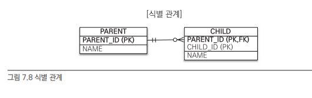


비식별 관계는 부모의 기본키는 외래키로만 사용한다. 자식 테이블의 기본키는 부모의 기본키와 관련이 없는 독자적인 키를 사용한다. 

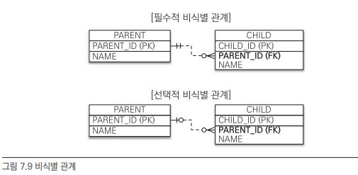

외래 키를 필수적으로 사용할지 말지에 따라 필수적과 선택적으로 나뉜다. 사용하지 않으면 null이다.


최근에는 비식별을 주로 사용하고 꼭 필요한 경우만 식별 관계를 사용한다.


### 복합 키 : 비식별 관계 매핑

JPA는 영속성 컨텍스트에 엔티티를 보관할 떄 엔티티의 식별자를 키로 사용한다.(구분만 할수있으면 식별자) 이러한 식별자를 구분하기 위해 equals와 hashCode를 사용해 동등성(완전히 같은지) 비교를한다. 식별자 필드가 하나면(Id가 하나) 보통 자바의 기본 타입을 쓰는데 식별자 필드가 2개 이상이면 별도의 식별자 클래스를 만들어 equals와 hashCode를 구현한다.

JPA는 복합키를 지원하기 위해 2가지 방법을 제공한다.

-  @IdClass : 관계형 데이터베이스에 가까운 방식
- @EmbeddedId : 객체지향에 가까운 방식


#### @IdClass

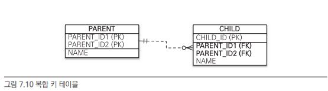

부모 테이블은 복합 기본 키를 사용하고 자식은 복합 외래 키를 사용한다. (관계형 데이터베이스에서 상속 개념은 없음)

복합키를 매핑하기 위해서는 식별자 클래스를 별도로 만들어야한다.

```
// 부모 클래스
@Entity
@IdClass(ParentId.Class)
public class Parent{
	@Id
	@Column(name = "PARENT_ID1")
	private String id1; // ParentId.id1 과 연결
	
	@Id
	@Column(name = "PARENT_ID2")
	private String id2; // ParentId.id2 과 연결
	
	...
}
```

@IdClass를 통해 식별자 클래스를 지정한다.

```
// 식별자 클래스
public class ParentId implements Serializable{
	private String id1; // Parent.id1 과 연결
	private String id2; // Parent.id2 과 연결
	
	public ParentId(){}
	public ParentId(String id1,String id2){this.id1=id1;this.id2=id2;}
	
	@Override
	public boolean equals(Object o){...}
	
	@Override
	public int hashCode(){...}
}
```

식별자 클래스의 속성명과 엔티티에서 사용하는 속성명이 같아야하고 Serializable 인테페이스를 구현해야한다. 또한 생성자를 만들어줘야한다.


부모의 복합키를 저장할때는 단순히 지정하면된다.

```
Parent parent = new Parent();
parent.setId("myid1");
parent.setId("myid2");
em.persist(parent);
```

여기서 id를 지정하고 영속성 컨텍스트에 저장하면 내부에서 id를 식별자 클래스 객체를 생성하고 영속성 컨텍스트의 키로 사용한다.


그래서 조회할때는 식별자 클래스로 호출해줘야한다.

```
ParentId parentId = new ParentId("myid1","myid2");
Parent parent = em.find(Parent.class,parent.Id);
```


자식 클래스는 부모의 기본키가 복합키이므로 외래키도 복합키로 저장한다.

```
// 자식 클래스
@Entity
public class Child{
	@Id
	private String id;
	
	@ManyToOne
	@JoinColumns({
		@JoinColumn(name = "PARENT_ID1", referencedColumnName = "PARENT_ID1"),
		@JoinColumn(name = "PARENT_ID2", referencedColumnName = "PARENT_ID2")
	})
	private Parent parent;
}
```

여기서 JoinColumn의 name은 테이블에 저장할 이름이고 referencedColumnName은 Parent 테이블에 복합키 이름이다. 둘이 같다면 referencedColumnName을 생략해도 된다.


#### @EmbeddedId

@EmbeddedId는 객체지향적인 방식이다.


```
// 부모 클래스
@Entity
public class Parent{
	@EmbeddedId
	private ParentId id;
	
	...
}
```

@IdClass와는 다르게 부모 클래스에 바로  @EmbeddedId와 식별자 클래스 타입으로 아이디를 지정한다.


```
// 식별자 클래스
@Embeddable
public class ParentId implements Serializable{
	@Column(name = "PARENT_ID1")
	private String id1;
	@Column(name = "PARENT_ID2")
	private String id2;
	
	// equals and hashCode
	...
}
```

@EmbeddedId는 바로 식별자 클래스에 기본키를 직접 매핑한다.


Parent는 ParentId 클래스로 부터 아이디를 받아 사용한다.

```
// Parent 저장
Parent parent = new Parent();
ParentId parentId = new ParentId("myid1","myid2");
parent.setId(parentId);
em.persist(parent);
```

 ```
 // Parent 조회
 ParentId parentId = new ParentId("myId1","myId2");
 Parent parent = em.find(Parent.class,parentId);
 ```

확실히 ParentId 식별자 클래스가 아이디 전담해주는 클래스임이 느껴진다.


**복합키와 eqauls(), hashCode()**

```
ParentId id1 = new ParentId();
id1.setId1("myId1");
id1.setId2("myId2");

ParentId id2 = new ParentId();
id2.setId1("myId1");
id2.setId2("myId2");

id1.equals(id2);
```

equals는 동등성 비교 연산자로 값(인스턴스의 동일성 비교)이 같은지 비교한다. 개념적으로 id1과 id2은 equlas가 참이어야하지만 거짓이되어(디폴트로 단순히 동일성 비교만 한다) 오버라이딩해줘 적절히 바꿔줘야 참이 된다.

영속성 컨텍스트는 엔티티의 식별자를 키로 사용해 엔티티를 관리하는데 식별자를 비교할때 equals와 hashCode를 사용한다. 그래서 동등성이 지켜지지 않으면 엉뚱한 엔티티가 조회되거나 조회를 할 수 없게된다. 그래서 복합키는 필수적으로 equals와 hashCode를 구현해줘야한다. 식별자 클래스는 equals() 와 hashCode()를 구현할때 모든 필드를 사용한다.


**@IdClass @EmbeddedId JPQL**

@EmbeddedId는 객체지향적이고 중복이 적어 더 좋아보이는데 상황에 따라 쿼리가 길어진다.

```
em.creaeteQuery("select p.id.id1,p.id.id2 from Parent p"); // @EmbeddedId
em.creaeteQuery("select p.id1,p.id2 from Parent p"); // @IdClass
```

@EmbeddedId에서는 식별자 클래스가 복합키를 전담하기 떄문이다.


### 복합키 : 식별 관계 매핑

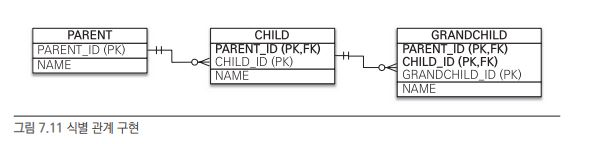

식별 관계에서는 자식은 부모의 외래 키를 자신의 기본키로 사용하기 때문에 자식에 손자까지 있다면 손자는 자식과 부모의 외래 키까지 기본키로 사용해야한다.


#### @IdClass

```
// 부모 클래스
@Entity
public class Parent{
	@Id @Column(name = "PARENT_ID")
	private String id;
	...
}

// 자식 클래스
@Entity
@IdClass(ChildId.class)
public class Child{
	@Id
	@ManyToOne
	@JoinColumn(name = "PARENT_ID")
	private Parent parent;
	
	@Id @Column(name = "CHILD_ID")
	private String childId;
	...
}

// 자식 ID (식별자 클래스)
public class ChildId implements Serializable{
	private String parent; // Child.parent 매핑
	private String childId; // Child.childId 매핑
	
	// equals, hashCode
	...
}

// 손자 클래스
@Entity
@IdClass(GrandChildId.class)
public class GrandChild{
	@Id
	@ManyToOne
	@JoinColumns({
		@JoinColumn(name = "PARENT_ID"),
		@JoinCOlumn(name = "CHILD_ID")
	})
	private Child child;
	
	@Id @Column(name = "GRANDCHILD_ID")
	private String id;
	
	...
}

// 손자 ID
public class GrandChildId implements Serializable{
	private ChildId child; // GrandChild.child 매핑
	private String id; // GrandChild.id 매핑
	
	// equals, hashCode
	...
}
```

좀 복잡한데 결국 식별자 매핑할때 @Id와 연관관계 매핑을 위한 @ManyToOne을 같이 사용해줘야한다.


#### @EmbeddedId

```
// 부모
@Entity
public class Parent{
	@Id @Column(name = "PARENT_ID")
	private String id;
	...
}

// 자식
@Entity
public class Child{
	@EmbeddedId
	private ChildId id;
	
	@MapsId("parentId") // ChildId.parentId 매핑
	@ManyToOne
	@JoinColumn(name = "PARENT_ID")
	public Parent parent;
	
	...
}

// 자식 ID
@Embeddable
public class ChildId implements Serializable{
	private String parentId; // @MapsId("parentId")로 매핑
	
	@Column(name = "CHILD_ID")
	private String id;
	
	// equals, hashCode
	...
}

// 손자
@Entity
public class GrandChild{
	@EmbeddedId
	private GrandChildId id;
	
	@MapId("childId") // GrandCHildId.childId 매핑
	@ManyToOne
	@JoinColumns({
		@JoinColumn(name = "PARENT_ID"),
		@JoinColumn(name = "CHILD_ID")
	})
	private Child child;
	
	...
}

// 손자 ID
@Embeddable
public class GrandChildId implements Serializable{
	private ChildId childId; // @MapsId("childId") 매핑
	
	@Column(name = GRANDCHILD_ID)
	private String id;
	
	...
}
```

@MapsId는 외래키와 매핑한 연관관계를 기본키에도 매핑하겠다는 말이다. 속성값은 식별자 클래스의 기본키 필드를 지정하면 된다. Child 클래스에서는 ChildId의 parentId 필드를 지정했다.


### 비식별 관계로 구현

위의 예제의 식별 관계 테이블을 비식별 관계로 변경하면 다음과 같다.

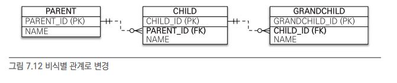

```
// 부모
@Entity
public class Parent{
	@Id @GeneratedValue
	@Column(name = "PARENT_ID")
	private Long id;
	private String name;
	...
}

// 자식
@Entity
public class Child{
	@Id @GeneratedValue
	@Column(name "CHILD_ID")
	private Long id;
	private String name;
	
	@ManyToOne
	@JoinColumn(name = "PARENT_ID")
	private Parent parent;
	...
}

// 손자
@Entity
public class GrandChild{
	@Id @GeneratedValue
	@Column(name = "GRANDCHILD_ID")
	private Long id;
	private String name;
	
	@ManyToOne
	@JoinColumn(name = "CHILD_ID")
	private Child child;
	...
}
```

식별 관계에서 복합키를 사용했을때와 비교해보면 매핑도 훨씬 쉽고 복합키도 사용하지않아 복합 키 클래스를 만들지 않아도 된다.


### 일대일 식별 관계

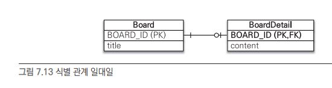

```
// 부모
@Entity
public class Board{
	@Id @GeneratedValue
	@Column(name = "BOARD_ID")
	private Long id;
	
	private String title;
	
	@OneToOne(mappedBy = "board")
	private BoardDetail boardDetail;
	...
}

// 자식
@Entity
public class BoardDetail{
	@Id
	private Long boardId;
	
	@MapsId // BoardDetail.boardId 매핑
	@OneToOne
	@JoinColumn(name = "BOARD_ID")
	private Board board;
	
	private String content;
	...
}
```

자식이 복합키를 사용하지 않은 부모의 Id 를 그대로 사용하는 식별 관계이기 때문에 @MapsId는 해당 엔티티의 기본키와 매핑이 된다.


저장할때도 자식이 부모만 매핑해주면 된다.

```
public void save(){
	Board board = new Board();
	board.setTitle("title");
	em.persist(board);
	
	BoardDetail boardDetail = new BoardDetail();
	boardDetail.setContent("content");
	boardDetail.setBoard(board); // 부모
	em.persist(boardDetail);
}
```

 ### 식별,비식별 관계의 장단점

DB 설계 관점에서는 다음과 같은 이유로 식별 관계보다 비식별 관계를 선호한다.

- 식별 관계에서 부모의 기본 키 컬럼은 하나지만 자식은 2개(부모+자식), 손자는 3개(부모,자식,손자)로 점점 기본 키 컬럼 갯수가 늘어난다. 이는 조인할때 더 복잡해지고 기본키 인덱스가 불필요하게 커진다.
- 식별 관계에서는 2개 이상의 컬럼을 합해 복합 기본키를 만들어야하는 경우가 많다.
- 식별 관계에서 기본 키로 비지니스 의미가 있는 자연 키 컬럼을 조합하는 경우가 많은데 이는 시간이 지남에 따라 비지니스 로직이 바뀌면 전체를 변경하기가 힘들어진다.
- 식별 관계에서 자식 테이블은 부모 테이블의 기본키를 자식 자신의 기본키로 사용해야하므로 테이블 구조가 유연하지 못하다.

객체 관계 매핑 관점에서는 비식별 관계를 선호한다.

- 일대일 관계를 제외하고 식별 관계에서는 2개 이상의 컬럼을 사용해 복합 키를 사용한다. JPA에서 복합키를 사용하기 위해서는 복합 키 클래스를 별도로 만들어줘야하는 번거로움이 생긴다.
- 비식별 관계의 기본 키는 주로 대리키를 사용하는데 JPA에서는 @GeneratedValue처럼 쉽게 대리키를 생성할 수 있다.


식별 관계의 장점도 있다. 기본 키 인덱스를 활용하기 쉽고 상위 테이블들의 기본키를 자식,손자들이 가지고 있기때문에 조인 없이 하위 테이블만으로 검색할 수 있다.

```
// 부모 아이디가 A인 모든 자식
SELECT * FROM CHILD
WHERE PARENT_ID='A'

// 부모 아이디가 A이고 자식 아이디가 B인 자식
SELECT * FROM CHILD
WHERE PARENT_ID='A' AND CHILD_ID='B'
```


정리하자면

가능하면 비식별 관계를 사용하고 기본키로 Long 타입의 대리 키를 사용하는것이다. 대리 키는 비지니스 로직과 아무 연관이 없어 유연한 대처가 가능하다. 또한 JPA에서는 @GeneratedValue 처럼 간편하게 대리클 생성할 수 있다.

자바에서 Integer는 범위가 20억 정도인데 Long은 920경 정도여서 Long을 쓰는게 안전하다.

선택적 비식별 관계보다 필수적 비식별 관계를 사용하는것이 좋다. 선택적 비식별 관계는 NULL을 허용해 외부조인을 사용해야하지만 필수적 비식별 관계는 NOT NULL이 보장되므로 내부조인만 사용해도 된다.


## 조인 테이블

데이터베이스 테이블의 연관관계 설계 방법은 크게 2가지다.

- 조인 컬럼 사용(외래키를 사용하는 방법)
- 조인 테이블 사용(사이에 테이블을 추가해서 사용하는 방법)


조인 컬럼 사용

외래키를 추가하여 참조하는 방식이다.

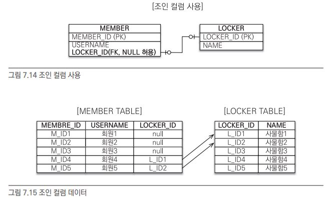

회원중 사물함이 없는 사람도 있기에 선택적 비식별 관계다. 그래서 NULL이 가능하고 외부 조인을 사용해야한다. 또한 회원들이 사물함이 거의 없다면 대부분 NULL로 채워질 것이다.


조인 테이블 사용

컬럼 대신 조인 테이블을 따로 만들어서 관리하는 방법이다.

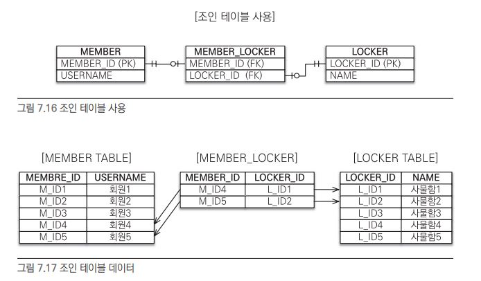

조인 테이블은 반드시 관계된 두 테이블의 정보를 가지고 있기에 내부 조인만으로 조인이 가능하다. 또한 기본 테이블에 외래키를 따로 사용하지 않아도 된다.

하지만 테이블을 따로 추가해야한다는 단점이 있다. 또한 조인 컬럼에서는 조인을 1번만 사용했는데 조인 테이블에서는 2번의 조인을 사용해야한다.

그래서 기본적으로 조인 컬럼을 사용하고 필요시 조인 테이블을 사용한다.

객체와 테이블 매핑시 @JoinColumn과 @JoinTalbe로 매핑이 가능하며

조인 테이블은 주로 다대다 관계를 일대다,다대일로 풀어낼때 사용된다.(일대일,일대다,다대이에서도 사용 하긴한다.)

### 일대일 조인 테이블

조인 테이블에 PARENT_ID는 기본키이고 CHILD_ID는 기본키는 아니지만 유니크 설정이 포함된다.

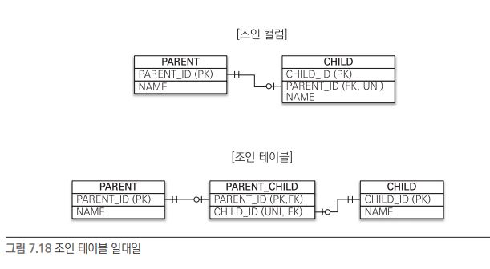

```
// 부모
@Entity
public class Parent{
	@Id @GeneratedValue
	@Column(name = "PARENT_ID")
	private Long id;
	private String name;
	
	@OneToOne
	@JoinTable(name = "PARENT_CHILD", // 매핑할 조인 테이블 이름
		joinColumns = @JoinColumn(name = "PARENT_ID"), // 현재 엔티티를 참조하는 외래 키
		inverseJoinColumns = @JoinColumn(name = "CHILD_ID")) //  반대방향 엔티티를 참조하는 외래 키
	private Child child;
	...
}

// 자식
@Entity
public class Child{
	@Id @GeneratedValue
	@Column(name = "CHILD_ID")
	private Long id;
	private String name;
	...
}
```

지금은 부모만 자식을 참조하는 단방향인데 양방향으로 바꾸려면 다음과 같이 추가해주면 된다.

```
// 자식
...
@OneToOne(mappedBy="child")
priavte Parent parent;
```

### 일대다 조인 테이블

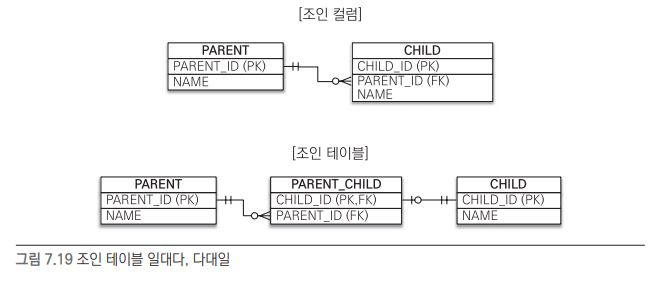

일대다 관계에서는 CHILD_ID만 유니크하면 된다.

단방향 관계일때의 매핑이다.

```
// 부모
@Entity
public class Parent{
	@Id @GeneratedValue
	@Column(name = "PARENT_ID")
	private Long id;
	private String name;
	
	@OneToMany
	@JoinTable(name = "PARENT_CHILD",
		joinColumns = @JoinColumn(name = "PARENT_ID"),
		inverseJoinColumns = @JoinColumn(name = "CHILD_ID"))
	private List<Child> child = new ArrayList<Child>();
}

// 자식
@Entity
public class Child{
	@Id @GeneratedValue
	@Column(name = "CHILD_ID")
	private Long id;
	private String name;
	...
}
```

부모 엔티티에서 조인 테이블을 리스트 형태로 만들어주면 된다.


### 다대일 조인 테이블

일대다를 반대로 해주면 된다.

```
// 부모
@Entity
public class Parent{
	@Id @GeneratedValue
	@Column(name = "PARENT_ID")
	private Long id;
	private String name;
	
	@OneToMany(mappedBy = "parent")
	private List<Child> child = new ArrayList<Child>();
	...
}

// 자식
@Entity
public class Child{
	@Id @GeneratedValue
	@Column(name = "CHILD_ID")
	private Long id;
	private String name;
	
	@ManyToOne(optional = false)
	@JoinTable(name = "PARENT_CHILD",
		joinColumns = @JoinColumn(name = "CHILD_ID"),
		inverseJoinColumns = @JoinColumn(name = "PARENT_ID"))
	private Parent parent;
	...
}
```

### 다대다 조인 테이블

두 테이블의 기본키를 이용한 하나의 복한 유니크 제약조건(기본 키 설정)을 걸어야한다.

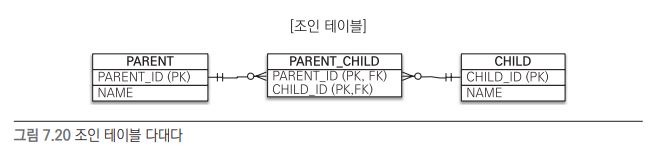

```
// 부모
@Entity
public class Parent{
	@Id @GeneratedValue
	@Column(name = "PARENT_ID")
	private Long id;
	private String name;
	
	@ManyToMany
	@JoinTable(name = "PARENT_CHILD",
		joinColumns = @JoinColumn(name = "PARENT_ID"),
		inverseJoinColumns = @JoinColumn(name = "CHILD_ID"))
	private List<Child> child = new ArrayList<Child>();
	...
}

// 자식
@Entity
public class Child{
	@Id @GeneratedValue
	@Column(name = "CHILD_ID")
	private Long id;
	private String name;
	...
}
```

조인 테이블에 외래키와는 별개로 새로운 컬럼을 추가한다면 @JoinTable 전략을 사용할 수 없다. 대신 새로운 엔티티를 만들어서 조인 테이블과 매핑해야한다.

## 엔티티 하나에 여러 테이블 매핑

잘 사용하지는 않지만 @SecondaryTable을 사용하면 한 엔티티에 여러 테이블을 매핑할 수 있다.

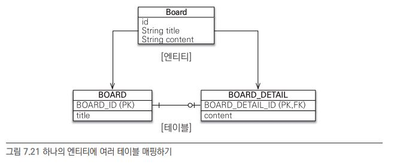

```
@Entity
@Table(name = "BOARD") // BOARD 테이블과 매핑
@SecondaryTable(name = "BOARD_DETAIL", // 매핑할 다른 테이블의 이름
	pkJoinColumns = @PrimaryKeyJoinColumn(name = "BOARD_DETAIL_ID")) // 다른 테이블의 기본 키명
public class Board{
	@Id @GeneratedValue
	@Column(name = "BOARD_ID")
	private Long id;
	
	private String title;
	
	@Column(table = "BOARD_DETAIL")
	private String content;
}
```

@Table을 통해 BOARD 테이블과 매핑하고 @SecondaryTable을 통해 BOARD_DETAIL과 매핑하였다.

하지만 이 방식보다는 각 테이블마다 엔티티를 만들어서 사용한것이 좋다. 왜냐면 조회할때 두 테이블을 항상 조회하기 때문이다.


## 실전 예제

상품의 종류로는 음반,도서,영화가 있다.(더 추가도 가능)

모든 상품에는 등록일과 수정일 있어야함.

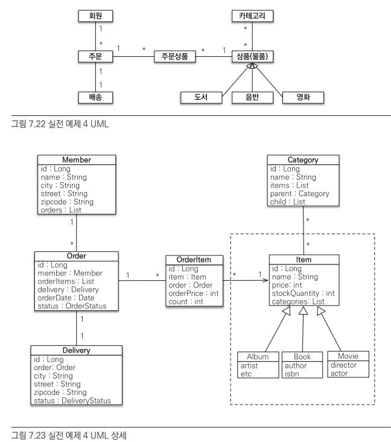

책에서는 여러 상품을 공통된 하나의 테이블로 표현하는 전략을 선택했다.

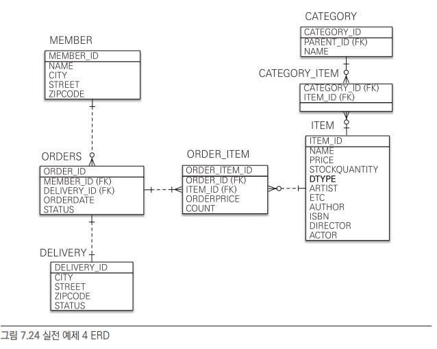


그래서 위와같이 변경사항을 수정했다.


기존 카테고리를 OneToMany , ManyToOne으로 해결했는데 이를 ManyToMany로 수정하였다.(조인 테이블 전략)

또한 아이템이 여러 종류로 나뉘는것을 단일 테이블 전략으로 설계하고 각 item,album,book,movie를엔티티로 만들어줬다.

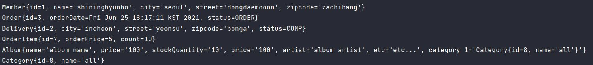

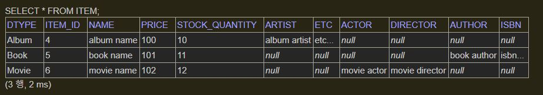

