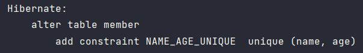
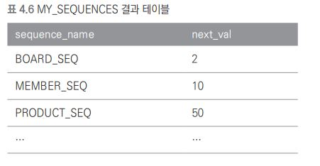
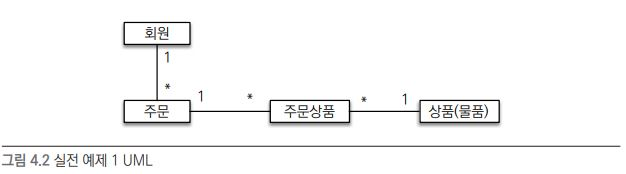
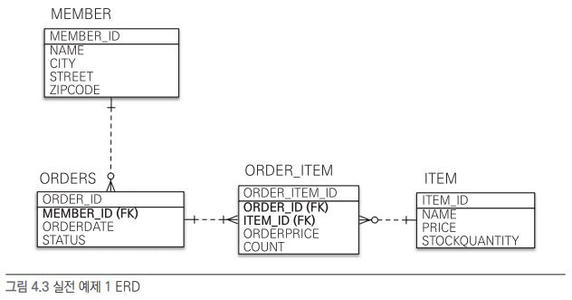
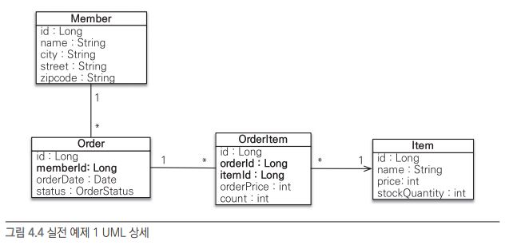

# 엔티티 매핑

JPA를 사용함에 있어 엔티티와 테이블을 매핑하는것이 중요하다.

그리고 매핑을 하는데에 있어 어노테이션을 숙지해야한다.

- 객체와 테이블 매핑 : @Entity, @Table
- 기본 키 매핑 : @Id
- 필드와 컬럼 매핑 : @Column
- 연관관계 매핑 : @ManyToOne, @JoinColumn

연관관계 매핑은 5,6,7장에서

## @Entity

JPA를 사용해 테이블과 매핑할 클래스는 @Entity 어노테이션이 필수로 붙어있어야한다.

name 속성을 사용하지 않으면 클래스 이름 그대로 엔티티 클래스를 사용한다.

주의사항

- 기본 생성자는 필수
- final 클래스, enum, interface, inner 클래스에는 사용 불가.
- 저장할 필드에 final을 사용하면 안됨.

## @Table

엔티티와 매핑할 테이블을 지정한다.

## 다양한 매핑 사용

Member 클래스에 다음과 같이 추가한다.

```
// 회원의 타입 구분
// 자바의 enum 을 사용하기 위해 @Enumerated 사용
@Enumerated(EnumType.STRING)
private RoleType roleType;

// 자바의 날짜 타입을 @Temporal 을 사용해 매핑
@Temporal(TemporalType.TIMESTAMP)
private Date createdDate;

@Temporal(TemporalType.TIMESTAMP)
private Date lastModifiedDate;

// 주석 사용. VARCHAR 대신에 CLOB 타입으로 저장.
// @Lob 을 사용하면 CLOB, BLOB 타입에 매핑 가능.
@Lob
private String description;
```

## DB 스키마 자동 생성

DB에 테이블을 직접 만들어주지 않고 자동으로 생성해줄 수 있다.

단 테스트 단계에서만 사용하고 실제 운영서버에서는 DDL 을 사용해서는 안된다.

```
<!-- DB에 테이블 자동 생성 -->
<property name="hibernate.hbm2ddl.auto" value="create" />
```


또한 자바에서는 myClass 처럼 카멜 케이스를 쓰는게 일반적이고

DB에서는 my_class 처럼 언더스코어 방식을 쓰는게 일반적이다.

이 또한 JPA에서 자동으로 바꿔줄 수 있다.

```
<!-- 기본 매핑 이름 자바에서는 카멜 DB 에서는 언더스코어 -->
<property name="hibernate.ejb.naming_strategy" value="org.hibernate.cfg.ImprovedNamingStrategy" />
```


## DDL 생성 기능

JPA에서 자동으로 스키마를 생성해주는데 이때 DDL에 제약 조건을 걸어줄 수 있다.

```
@Column(name="NAME",nullable = false,length = 10)
private String username;
```

username은 not null 이고 varchar(10) 크기로 생성된다.


유니크 설정도 가능하다.

```
@Table(name="Member",uniqueConstraints = {
        @UniqueConstraint(
                name="NAME_AGE_UNIQUE",
                columnNames = {"NAME","AGE"}
        )
}) 
```

그러면 다음과 같이 테이블 생성시 속성이 추가된다.




이러한 DDL 기능은 테이블 생성에만 영향을 끼치고

JPA 실행 로직 자체에는 영향을 주지 않는다.


## 기본 키 매핑

데이터베이스마다 기본 키를 생성하는 방식이 서로 달라

데이터베이스가 기본 키를 생성해주는 전략에는 여러가지가 있다.

- 직접 할당 : 기본 키를 애플리케이션에서 직접 할당.
- 자동 생성 : 대리 키 사용 방식
  - IDENTITY : 기본 키 생성을 데이터베이스에서 위임
  - SEQUENCE : 데이터베이스 시퀀스를 사용해 기본 키 할당
  - TABLE : 키 생성 테이블을 사용


이렇게 자동 생성 전략이 다른 이유는 데이터베이스 벤더마다 지원하는 방식이 달라서 그렇다.

오라클은 시퀀스를 제공하지만 MySQL은 지원하지 않는다. (대신 MySQL은 auto_increment)

그래서 IDENTITY, SEQUENCE 전략은 사용하는 DB에 의존.

TABLE 전략은 키 생성용 테이블을 따로 만들어 시퀀스처럼 사용하는 방식.


기본 키를 직접할당하려면 @Id를 쓰면되고

자동 생성 전략을 사용하려면 @Id에 @GeneratedValue를 추가로 쓰면된다.


또한 키 생성 전략을 사용하려면 다음 속성을 반드시 추가해야한다.

```
<property name="hibernate.id.new_generator_mappings" value="true" />
```

하이버네이트는 더 효과적인 키 생성 전략을 개발했는데 호환성을 유지하기위해 false가 기본값이다. 기존 시스템 유지보수를 하는게 아니면 true로 사용.


### 기본 키 직접 할당 전략

직접 기본키를 넣어주는 방식이다.

엔티티는 다음처럼 설정했을때

```
@Id
@Column(name="id")
private String id;
```

persist 영속성 컨텍스트에 저장하기 전에 각각 값을 넣어주는 것이다.

```
Board board = new Board();
board.setId("id1");
em.persist(board);
```


### IDENTITY 전략

데이터베이스에서 기본키 생성을 위임받는 경우다.

주로 MySQL, PostgreSQL, SQL Server, DB2에서 사용한다.

제일 많이 쓰는 MySQL에 AUTO_INCREMENT 기능이 있다.

```
CREATE TABLE BOARD{
	ID INT NOT NULL AUTO_INCREMENT PRIMARY KEY,
	DATA VARCHAR(255)
};
```

데이터 삽입시 자동으로 ID값이  1,2 증가하며 채워진다.


이를 @GeneratedValue 어노테이션에 전략을 GenerationType.IDENTITY로 설정해 자동 증가를 할수있다.

```
@Id
@GeneratedValue(strategy = GenerationType.IDENTITY)
private Long id;
```

(단 데이터베이스에서 생성되는 값이기 떄문에 조회하려면 반드시 추가로 DB 조회를 해야한다. JDBC3에 추가된 Statemen,getGeneratedKeys()를 사용하면 저장하면서 바로 생성된 기본키를 조회 할 수 있다. 하이버네이트는 이 메소드를 사용해 한 번만 데이터베이스와 통신한다.)

### SEQUENCE 전략

데이터베이스 시퀀스는 유일한 값을 순서대로 생성하는 특별한 데이터베이스 오브젝트다.

이 시퀀스를 사용해 기본 키를 생성하는 전략인데, 오라클, PostgreSQL, DB2, H2 데이터베이스에서 사용이 가능하다.


시퀀스 DDL

```
CREATE SEQUENCE BOARD_SEQ START WITH 1 INCREMENT BY 1;
```


매핑 코드

```
@Entity
@SequenceGenerator(
	name="BOARD_SEQ_GENERATOR",
	sequenceName="BOARD_SEQ",
	initialValue=1,allocationSize=1
)

...

@Id
@GeneratedValue(strategy = GenerationType.SEQUENCE, generator = "BOARD_SEQ_GENERATOR")
private Long id;
```


BOARD_SEQ와 BOARD_SEQ_GENERATOR를 매핑하여

id 값을 BOARD_SEQ_GENERATOR 시퀀스 생성기가 할당한다.


IDENTITY와 호출 방식은 동일한데 차이점은

SEQUENCE 전략은 em.persist()를 호출할 떄 먼저 데이터베이스 시퀀스를 사용해 식별자를 조회하고, 조회한 식별자를 엔티티에 할당한 후 엔티티를 영속성 컨텍스트에 저장한다. 그래서 플러시하지 않아도 아이디를 사용할 수 있다. 


### TABLE 전략

TABLE 전략은 키 생성 전용 테이블을 따로 만들고 여기에 이름과 값으로 사용할 컬럼을 만들어 데이터베이스 시퀀스를 흉내내는 전략이다. 이 전략은 모든 DB에서 사용이 가능하다.

단 키 생성 용도의 테이블을 만들어야한다.

```
CREATE TABLE MY_SEQUENCES(
	sequence_name varchar(255) not null,
	next_val bigint,
	primary key (sequence_name)
)
```

sequence_name 컬럼으로 시퀀스 이름을 사용하고 next_val 을 시퀀스 값으로 사용한다.


```
@TableGenerator(
        name="BOARD_SEQ_GENERATOR",
        table = "MY_SEQUENCES",
        pkColumnValue = "BOARD_SEQ",
        allocationSize = 1
)

...

@Id
@GeneratedValue(strategy = GenerationType.TABLE, generator = "BOARD_SEQ_GENERATOR")
```

먼저 @TableGenerator를 사용해 테이블 키 생성기를 등록한다.

해당 예제에서는  BOARD_SEQ_GENERATOR라는 테이블 키 생성기를 등록하고 MY_SEQUENCES 테이블과 매핑했다.

그리고 GenerationType.TABLE을 선택해 TABLE 전략을 설정하고

@GeneratedValue.generator로 테이블 생성기를 지정했다.

이렇게해서 id 식별자 값은 BOARD_SEQ_GENERATOR 테이블 키 생성기가 할당한다. 


엔티티를 넣어주면 다음과같이 할당된다.



( 예제는 따로 해보지 못했음 )


### AUTO 전략

데이터베이스 방언에 따라 기본키를 자동으로 생성해준다.

MySQL을 사용하면 IDENTITY, 오라클을 사용하면 SEQUENCE가 선택된다.

```
@Id
@GeneratedValue(strategy = GenerationType.AUTO)
private Long id;
```

아니면 그냥 GeneratedValue 전략도 AUTO기 떄문에 생략해도된다.

```
@Id @GeneratedValue
private Long id;
```


AUTO 사용시 SEQENCE나 TABLE 전략은 시퀀스나 키 생성 테이블을 미리 만들어 둬야한다. 근데 이또한 스키마 자동 생성 기능을 사용한다면 하이버네이트가 기본값을 사용해 적절한 시퀀스나 키 생성용 테이블을 만들어준다.


## 필드와 컬럼 매핑

### @Column

객체 필드를 테이블 컬럼에 매핑한다.

속성 중 name, nullable이 주로 사용된다.


### @Enumerated

자바의 enum 타입을 매핑할 떄 사용.

enum은 데이터베이스 저장시 숫자로 저장하면 순서변경시 문제가 생긴다.

ex) ADMIN, USER에서 ADMIN, NEW, USER 로 순서를 변경할 수 없다.

EnumType.STRING을 사용하면 순서를 바꿀 수 있는대신에 저장 크기는 커진다.


### @Temporal

날짜 타입을 매핑할때 사용.

- TemporalType.DATE - 날짜
- TemporalType.TIME - 시간
- TemporalType.TIMESTAMP - 날짜와 시간

MySQL에서는 datetime을 예약어로 쓰는데 방언 설정 덕분에 문제가 되지 않는다.


### @Lob

데이터베이스 BLOB, CLOB 타입과 매핑한다.

@Lob은 속성을 지정할수 없지만 매핑 필드 타입이 문자면 CLOB이고 나머지는 BLOB으로 매핑한다.


### @Transient

이 필드는 매핑하지 않는다. DB에 저장하지도 조회하지도 않는다. 임시로 저장할때 사용한다.


### @Access

JPA가 엔티티 데이터를 접근하는 방식을 지정.

- 필드 접근 : AccessType.FIELD로 지정. 필드에 직접 접근한다.

  @Id가 필드에 있으면 필드로 접근을 선택한것과 같아서 @Access를 생략해도 된다.

- 프로퍼티 접근 : AccessType.PROPERTY로 지정. 접근자(Getter)를 사용해 접근.

  @Id를 써서 기본 전략은 필드로 하고 특정 필드만 프로퍼티 전략으로 쓸 수 있다.

  ```
  @Access(AccessType.PROPERTY)
  public String getFullName(){
  	return firstName+lastName;
  }
  ```


## 실전 예제

주문 시스템 만들기

- 회원은 주문을 할 수있고
- 주문당 여러개의 상품이 존재(N:M 관계)
- 단 N:M 관계는 관계형 데이터베이스나 엔티티에서 거의 사용하지 않아 1:N으로 치환









ㅉ
