# 다양한 연관관계 매핑

엔티티를 매핑할때는 두 엔티티가 어떠한 관계인지 일대다인지 일대일인지 먼저 다중성을 구분하고

그렇다면 방향은 단방향으로 할건지 아니면 양방향으로 할건지 정하고

양방향으로 정했다면 연관관계의 주인은 누구로할지 정해야한다.


#### 다중성

- 다대일 - @ManyToOne
- 일대다 - @OneToMany
- 일대일 - @OneToOne
- 다대다 - @ManyToMany

보통 다대일과 일대다를 거의 사용하고 다대다는 거의 사용하지 않는다.

#### 단방향, 양방향

테이블은 외래 키 하나로 조인을 사용해 무조건 양방향이지만(원래는 방향 개념이 없음) 객체는 참조를 통해 방향성을 고려해줘야한다.

#### 연관관계의 주인

테이블은 외래 키를 사용하여 연관관계를 관리하는 포인트가 하나지만, 객체에서 양방향 관계는 서로를 참조하므로 연관관계를 관리하는 포인트는 두군데이다. 그래서 둘 중에 하나를 골라서 외래 키를 관리하는 연관관계 주인을 정해야한다.보통은 외래 키를 가진 테이블과 매핑한 엔티티가 효율적이므로 주인이 된다.


## 다대일

다대일 관계에서 다 쪽이 외래 키를 가진 테이블과 매핑되고 외래 키를 관리하는 엔티티가 항상 연관관계의 주인이다.

### 다대일 단방향

Member와 Team 엔티티에서는 Member가 다가 되고 외래 키를 관리하게 된다.

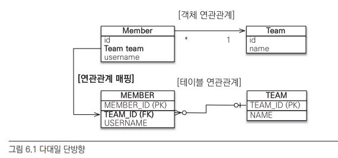

단방향 관계이니 Member 에서만 Team을 참조할 수 있다.

```
// Member 엔티티
@ManyToOne
@JoinColumn(name = "TEAM_ID")
private Team team;
```

@JoinColumn(name =  "TEAM_ID")를 사용하여 Member.team 필드를 TEAM_ID 외래 키와 매핑한다.

그래서 Member.team 필드로 회원 테이블의 TEAM_ID 외래 키를 관리할 수 있게된다.


### 다대일 양방향

양방향 관계에서는 연관관계의 주인이 생긴다.

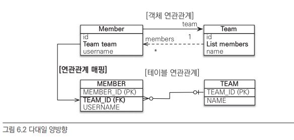

양방향 관계에서 외래 키를 가지는 다 쪽이 연관관계의 주인이다. 주인이 아닌쪽은 mappedBy 속성으로 주인이 어떠한 필드명으로 참조하는지 명시한다.

```
// Team 엔티티
@OneToMany(mappedBy = "team")
private List<Member> members = new ArrayList<Member>();
```


두 엔티티는 서로를 항상 참조해야한다.

단 양쪽모두 참조하면 한쪽을 호출했을때 서로 반복해서 호출하는 무한루프가 생기니 이를 항상 고려해야한다.

ex) setTeam(), addMember()

```
// Member 엔티티
public void setTeam(Team team){
	this.team = team;
	
	if(!team.getMembers().contains(this)){
		team.getMembers().add(this);
	}
}
```
```
// Team 엔티티
public void addMember(Member member){
	this.members.add(member);
	
	if(member.getTeam() != this){
		member.setTeam(this);
	}
}
```


## 일대다

일대다는 다대일의 반대 방향의 관계이다. 일대다 관계는 엔티티를 하나 이상 참조해야하므로 자바 컬렉션인 Collection, List, Set, Map 중에 하나를 사용한다.

### 일대다 단방향

하나의 팀이 여러 회원을 참조하면 일대다 관계가 된다. 그리고 팀은 회원을 참조하지만 반대로 회원은 팀을 참조하지 않으면 단방향 관계가 된다.

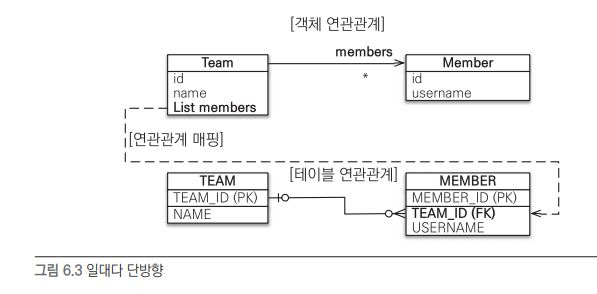

테이블 erd와 객체 uml을 보면 그림이 조금 독특하다. 연관관계의 주인은 Team으로 정했지만 테이블상에서는(물리적으로) Member가 fk로 Team을 참조하기 때문에 Team의 필드로 MEMBER fk를 관리하게 된다. 

```
// Team 엔티티
@OneToMany
@JoinColumn(name = "TEAM_ID")
private List<Member> members = new ArrayList<Member>();
```

Team 엔티티에서 MEMBER 클래스의 TEAM_ID라는 FK를 매핑하고 있다.


#### 단점

이러한 방식은 문제점이 있다. 매핑한 객체가 괸리하는 외래 키와 다른 테이블에 있다는 점이다. 매핑한 객체가 외래 키와 같은 테이블이라면 연관관계 처리시 INSERT SQL 한번으로 가능하지만, 다른 테이블에 외래 키가 있다면 UPDATE SQL문을 추가로 실행해줘야한다.

```
team1.getMembers().add(member1);
team1.getMembers().add(member2);

em.persist(member1); // INSERT-member1
em.persist(member2); // INSERT-member2
em.persist(team1); // INSERT-team1, UPDATE-member1.fk, UPDATE-member1.fk
```

team1을 영속상태로 만들때 실제 외래 키가 있는 테이블에 외래 키를 변경해줘야해서 UPDATE 문이 추가로 발생하게된다.

Member 엔티티는 Team 엔티티를 모르고 Team 엔티티는 members가 관리한다. 그래서 Member 엔티티를 저장할때는 Member 엔티티는 본인만 저장하고 fk(TEAM_ID)는 널인 상태다. 후에 Team 엔티티를 저장할때 fk를 업데이트 해준다.

이렇게 일대다에서 단방향 방식은 엔티티를 매핑하지 않은 다른 테이블의 외래 키를 관리해야하기 떄문에 성능 문제(추가 UPDATE)도 있고 관리도 힘들다. 그래서 차라리 다대일을 사용해서 외래 키를 갖고있는 테이블과 단방향 엔티티를 매핑해 이러한 문제를 방지하는게 좋다.

> 단방향 관계는 다대일로 하는게 맞구나. (fk 테이블의 엔티티 매핑)


### 일대다 양방향

일대다 양방향 매핑은 존재하지 않고 다대일 양방향 매핑을 사용해야한다.(여기서 일대다 양방향을 일이 주인관계라고 본거임.)

양쪽 엔티티에 JoinColumn을 쓰고 한쪽을 읽기전용으로만 만들면 가능하지만 일대다 단방향 매핑의 단점이 그대로 드러나 굳이 이렇게 사용하지 않는다.


## 일대일

양쪽이 서로 하나의 관계만 가짐. 회원 한명과 사물함같은 관계.

일대일은 주 테이블, 대상 테이블 어느곳이든 외래 키를 가질 수 있음.

- 주 테이블에 외래 키

  주 객체가 대상 객체를 참조하는 것처럼 주 테이블에 외래 키를 두고 대상 테이브을 참조. 외래 키를 객체 참조와 비슷하게 사용할 수 있어 객체지향 개발자들이 선호.

- 대상 테이블에 외래 키

  전통적인 데이터베이스 개발자들이 대상 테이블에 외래 키를 두는 거을 선호. 테이블 관계를 일대일에서 일대다로 변경할 때 테이블 구조를 그대로 유지 가능.


### 주 테이블에 외래 키

일대일 관계를 구성할 때 객체지향 개발자들이 주 테이블에 외래 키가 있는것을 선호한다.

JPA도 주 테이블에 외래 키가 있으면 더 편리하게 매핑할 수 있다.


#### 단방향

MEMBER가 주 테이블이고 LOCKER가 대상 테이블.

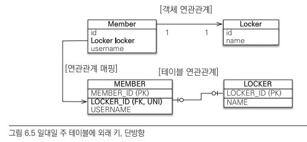

```
// Member 엔티티
@OneToOne
@JoinColumn(name = "LOCKER_ID")
private Locker locker;
```

형태가 다대일에서 단방향 관계와 거의 똑같다.


#### 양방향

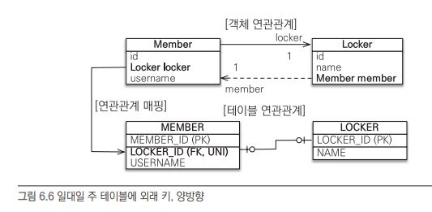

```
// Member 엔티티
@OneToOne
@JoinColumn(name = "LOCKER_ID")
private Locker locker;
```

```
// Locker 엔티티
@OneToOne(mappedBy = "locker")
private Member member;
```


양방향 관계에서 MEMBER 테이블에 외래 키가 존재하므로 Member.locker가 주인이 된다.

또한 일대일 관계이므로 fk에 유니크 제약조건을 걸어 놓는게 좋다.

### 대상 테이블에 외래 키

#### 단방향

일대일 관계 중 대상 테이블에 외래 키가 있는 단방향 관계는 JPA에서 지원하지 않는다.

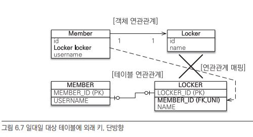

논리적으로 말이되지 않는다.

(JPA2.0 부터는 일대다 단방향 관계에서 대상 테이블에 외래 키가 있는 매핑을 허용했지만 일대일은 허용하지 않는다.)

#### 양방향

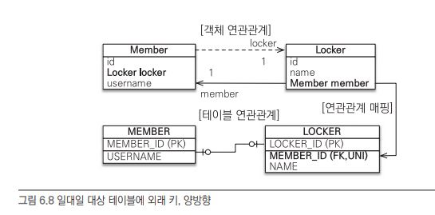

```
// Member 엔티티
@OneToOne(mappedBy = "member")
private Locker locker;
```
```
// Locker 엔티티
@OneToOne()
@JoinColumn(name = "MEMBER_ID")
private Member member;
```

> 주 테이블에 외래 키에 양방향과 차이점을 모르겠다.(주 테이블과 대상 테이블을 정하기 나름인가?)

(지연 로딩시 문제가 생긴다. Locker.member는 외래 키와 매핑되기 때문에 지연로딩이 가능하지만 Member.locker는 지연로딩으 ㄹ해도 즉시로딩이 된다. 프록시 대신 bytecode instrumentation으로 해결가능하단다.)


## 다대다

관계형 데이터베이스에서 테이블 2개로 다대다 관계를 표현할 수 없다. 그래서 중간에 테이블을 하나둬서 일대다, 다대일로 표현한다.

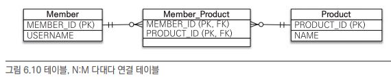


근데 객체는 가능하다 서로 컬렉션으로 표현하면 회원에서 상품들을, 상품에서 회원들을 표현할 수 있다.

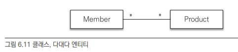


### 다대다 단방향

```
// Member 엔티티
@ManyToMany
@JoinTable(name = "MEMBER_PRODUCT",joinColumns = @JoinColumn(name = "MEMBER_ID"), inverseJoinColumns = @JoinColumn(name = "PRODUCT_ID"))
private List<Product> products = new ArrayList<Product>();
```

회원 엔티티와 상품 엔티티를 @ManyToMany로 매핑했다. @ManyToMany와 @JoinTable 만을 사용하여 Member_Product 엔티티를 사용하지 않고 매핑을 했다. (실제 테이블에는 연결 테이블인 MEMBER_PRODUCT가 존재)

@JoinTable의 속성이다

- @JoinTable.name : 연결 테이블을 지정함. 이 예제에서는 MEMBER_PRODUCT.
- @JoinTable.joinColumns : 현재 방향인 회원과 매핑할 조인 컬럼 정보를 지정. 여기서는 MEMBER_ID.
- @JoinTable.inverseJoinColumns : 반대 방향인 상품과 매핑할 조인 컬럼 정보를 지정. 여기서는 PRODUCT_ID.


@ManyToMany 덕분에 연결 테이블을 사용하지 않고 매핑하였다. (연결 테이블은 테이블끼리 표현하기 위한 용도다.)


저장은 다음과 같다.

```
Product productA = new Product();
em.persist(productA);

Member member1 = new Member();
member1.getProducts().add(productA) // 연관관계 설정
em.persist(member1);
```

member1에만 제대로 넣어주면 된다.


탐색은 다음과 같다.

```
Member member = em.find(Member.class,"member1");
List<Product> products = member.getProducts(); // 객체 그래프 탐색
for(Product product : products){
	System.out.println(product.getName());
}
```


상품 이름이 호출될때 다음 SQL 문이 실행된다.

```
SELECT * FROM MEMBER_PRODUCT MP
INNER JOIN PRODUCT P
ON MP.PRODUCT_ID=P.PRODUCT_ID
WHERE MP.MEMBER_ID=?
```

연결 테이블과 상품 테이블을 조인해서 연관된 상품을 조회한다.


### 다대다 양방향

역방향도 비슷하게 @ManyToMany를 사용한다.그리고 주인이 아닌쪽에 mappedBy로 지정해준다.

```
// Product 엔티티
@ManyToMany(mappedBy = "products")
private List<Member> members = new ArrayList<Member>();;
```

역방향도 연관관계를 설정해줘야하는데 한 메소드에서 설정하면 편리하다

```
public void addProduct(Product product){
	...
	product.add(product);
	product.getMembers().add(this);
}
```


양방향 연관관계를 만들어줬으므로 반대로 product에서 members를 호출하는것도 가능하다.

```
Product product = em.find(Product.class,"productA");
List<Member> members = product.getMembers();
for (Member member : members){
	System.out.println(member.getUserName());
}
```


### 매핑의 한계와 극복, 연결 엔티티 사용 (식별 관계)

보통 회원과 상품 테이블 관계에서 회원이 주문을 하면 주문 수량이나 날짜가 있어야한다. 그러면 이를 연결 테이블에 넣어줘야한다. 

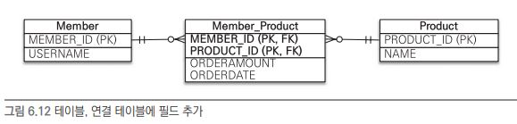

문제는 이제 회원 엔티티나 상품 엔티티에서 추가한 주문 수량과 날짜를 매핑할 수가없다.(연결 엔티티가 없잖아요.)


그래서 연결 엔티티를 사용해준다.

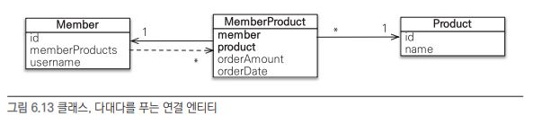

다시 일대다, 다대일 관계로 표현이 된것이다.


그러면 Member는 다음과 같이 나타낸다.

```
// Member 엔티티
@OneToMany(mappedBy = "member")
private List<MemberProduct> memberProducts;
```

Member와 MemberProduct 엔티티는 양방향 관계로 만들어주면 주인은 MemberProduct가 된다.


Product 엔티티는 이제 단방향 관계니 연관관계를 표시해주지 않아도된다.


이제 제일 중요한 연결 엔티티인 MemberProduct다.

```
// MemberProduct 엔티티
@Entity
@IdClass (MemberProductId.class)
public class MemberProduct{
	@Id
	@ManyToOne
	@JoinColumn(name = "MEMBER_ID")
	private Member member; // MemberProductId.member와 연결
	
	@Id
	@ManyToOne
	@JoinColumn(name = "PRODUCT_ID")
	private Product product; // MemberProductId.product와 연결
	
	...
}
```

```
// MemberProduct 식별자 클래스
public class MemberProductId implements Serializable{
	private String member; // MemberProduct.member와 연결
	private String product; // MemberProduct.product와 연결
	
	// equals와 hashCode 구현
	@Override
	public boolean equals(Object o){...}
	
	@Override
	public int hashCode(){...}
}
```

MemberProduct는 MEMBER_ID와 PRODUCT_ID 두개를 모두 조합해서 사용하는 복합키를 사용한다. JPA에서 복합 키를 사용하기 위해서는 @IdClass(@EmbeddedId를 사용하는 방법도 있다.)를 사용하고 별도의 식별자 클래스를 생성해줘야한다.

(식별자 클래스는 Serializalbe을 구현해야하고 기본 생성자가 있어야하고 public 클래스로 만들어줘야한다.)

그리고 이 복합키들은 기본키이면서 외래 키와 매핑하므로  @JoinColumn을 통해 매핑해준다.

이렇게 부모 테이블의 기본키를 받아서 자신의 기본키+외래키로 사용하는것을 데이터베이스 용어로 식별 관계(Identifying Relationship)라 한다.


종합하면 MemberProduct는 Member의 기본키를 받아 자신의 기본키와 동시에 Member 엔티티와 연결을 위한 외래키로 사용하고 Product의 기본키를 받아 자신의 기본키와 동시에 Prodict 엔티티와 연결을 위한 외래키로 동시에 사용한다. 그리고 MemberProdictId 식별자 클래스로 두 기본키를 묶어 복합키로 사용한다.

저장할때는 MemberProduct 엔티티에 저장해준다.

```
MemberProduct mp = new MemberProduct();
mp.setMember(member1); // 연관관계
mp.setProduct(productA); // 연관관계
mp.setOrderAmount(10); // 새로운 필드
em.persist(mp);
```


조회할때는 식별자 클래스를 이용해 연결 엔티티(MemberProduct)를 조회하고 이를 통해 Member와 Product를 조회한다.

```
MemberProductId mpId = new MemberProdictId();
mpId.setMember("member1");
mpId.setMember("productA");

MemberProduct mp = em.find(MemberProduct.class,mpId);
Member member = mp.getMember();
Product product = mp.getProduct();
```

 

복합키를 사용하게되면 이것저것 할게 많아 복잡해진다. (식별자 클래스, @IdClass 또는 @EmbeddedId, Serialize 구현 등)


### 새로운 기본 키 사용 (비식별 관계)

복합키를 이용하는것이 복잡하다는것을 앞에서 알아버렸다.

그러면 차라리 새로운 키값을 사용하는것이다. (데이터베이스에서 자동으로 생성해주는값)

그리고 MemberProduct는 사실상 주문 역할을 하니 Order라고 부른다.


이제 Order 엔티티는 많이 단순해진다.

```
@Entity
public cloass Order{
	@Id @GeneratedValue
	@Column(name = "ORDER_ID")
	private Long Id; // 새로운 기본키
	
	...
}
```

나머지 Member와 Product는 변하는 부분이 없다.


실제로 저장과 조회할때도 단순해진다.

```
// 저장
Order order = new Order();
order.setMember(member1);
order.setProduct(productA);
order.setOrderAmount(10);
em.persist(order);
```

```
// 조회
Long orderId = 1L;
Order order = em.find(Order.class,orderId);

Member member = order.getMember();
Product product = order.getProduct();
```


### 다대다 연관관계 정리

다대다는 두 엔티티가 관계를 맺을떄 새롭게 생기는 필드를 저장하기 위해 새로운 테이블을 추가해 다대일 관계로 풀어냈다.

그리고 추가된 테이블의 기본키를 표현하기 위해서 2가지 선택을 했다.

- 식별 관계 : 식별자(Member_ID)를 기본 키 + 외래 키를 사용. (Member_ID 그대로 기본키로 사용)
- 비식별 관계 : 식별자는 외래 키로만 사용하고 새로운 식별자 추가.(Order_ID 새롭게 추가.)


데이터 베이스 설계에서 부모 테이블의 기본 키를 받아 자식 테이블이 그 키를 기본 키 + 외래 키로 사용하는것을 식별 관계라고 하고 그냥 부모의 키를 단순히 외래 키로만 사용하는것을 비식별 관계라고 한다. 객체 입장에서는 비식별 관계가 식별자 클래스를 만들지 않아도 되므로 단순,편리하게 ORM과 매핑할 수 있다. 그래서 비식별 관계가 더 많이 사용된다.


## 실전 예제

상품을 주문하는 시스템이다.

이전 예제에서 배송과 카테고리가 추가되었다.

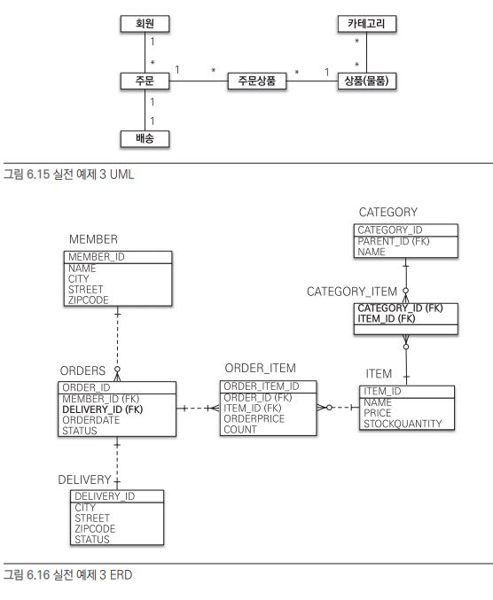

- 아이템과 카테고리는 다대다 관계이므로 연결 테이블을 추가해 구현한다.

- 주문과 배송은 일대일 관계인데 주문이 주로 배송을 참조하므로 주문에 외래 키를 둔다.


상세 UML은 다음과 같다.

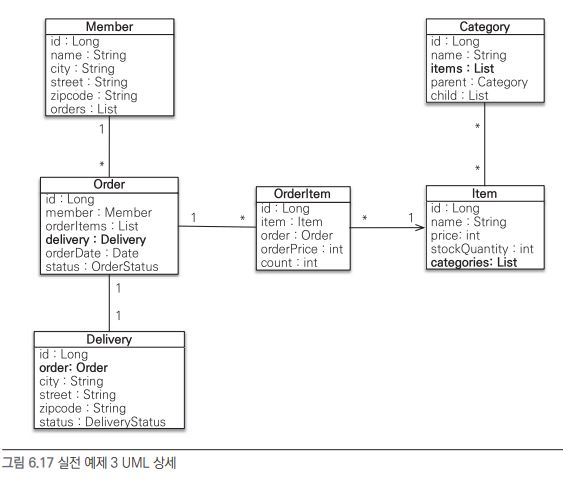

나는 저 아이템과 카테고리 사이에 ItemCategory라는 연결 엔티티를 다대일로 만들어 구현하였다.


또한 일대일 관계에서도 주인이 새로운 관계를 맺을때 inverse의 예전 관계는 안끊어질거같아서 끊게했다.(null 대입)

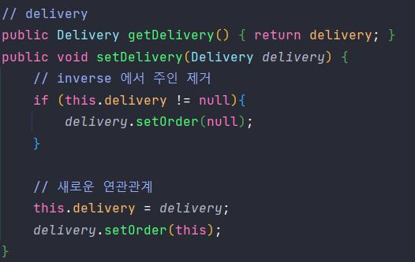


결과는 이쁘게 잘 나온다.

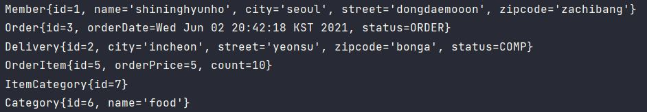
