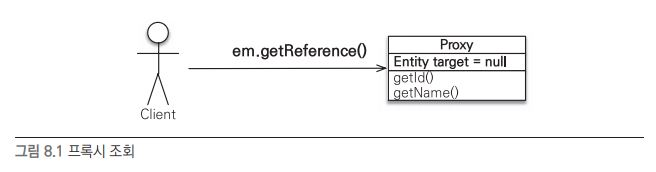
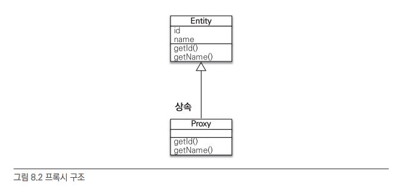
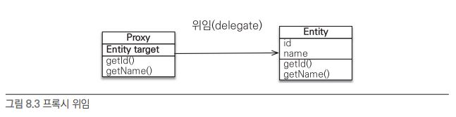
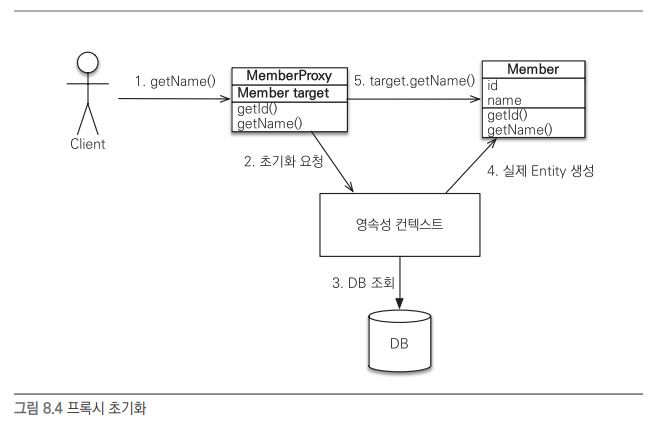
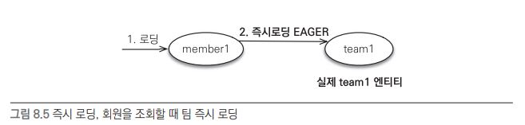
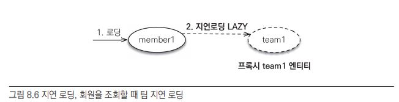
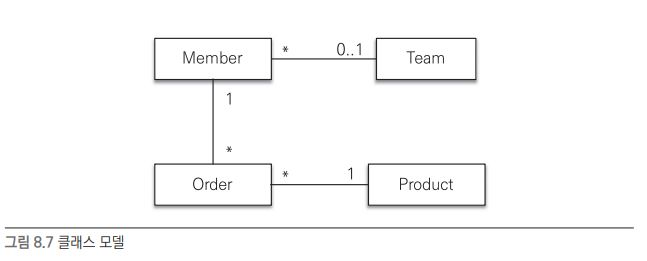
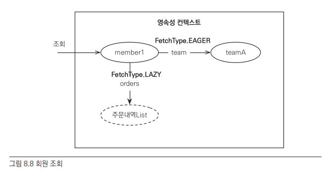
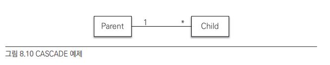
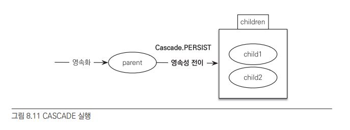

.

# 8. 프록시와 연관관계 관리

객체는 객체 그래프로 연관된 객체를 탐색하는데 연관된 객체를 탐색하기 위해서는 DB를 접근을 해야한다. 객체가 연관된 객체를 가지고있지만 실제 사용하지 않을수도있어 처음부터 연관된 모든 객체를 DB에서 불러오는건 엄청난 낭비다. 이러한 문제를 프록시(가짜 연관 객체)로 해결한다.(즉시로딩, 지연로딩)

## 프록시

다음과 같이 Member 엔티티와 Team 엔티티가 존재한다고하자.

```
// Member 엔티티
@Entity
public class Member{
	private String userName;
	
	@ManyToOne
	private Team team;
	...
}

// Team 엔티티
@Entity
public class Team{
	private String teamName;
	...
}
```

이때 Member에 userName을 호출하고 싶다면 Member만 DB에서 가져오면 되지 Team까지 찾아서 가져올 필요는 없다. 그리고 필요할때 DB에서 갖고오면 될것이다. 이러한 방법을 지연 로딩이라고한다.

그렇다면 Member 객체를 호출했을때 가짜 Team 객체가 필요한데 이를 프록시 객체라고 한다. 

### 프록시 기초

JPA에서 엔티티를 조회하려면 다음과 같이 했다.

```
Member member = em.find(Member.class,"member1");
```

영속성 컨텍스트에서 해당 데이터가 존재하지 않으면 DB에 접근하게 된다.

그렇다면 엔티티를 실제 사용하는 시점까지 DB 접근을 미루고 싶다면 어떻게할까. 레퍼런스로 접근하면 된다.

```
Member member = em.getReference(Member.class,"member1");
```

이 메소드를 호출하면 JPA는 DB를 조회하지 않고 실제 객체 엔티티를 생성하지도 않는다. 대신 DB 접근을 위임한 프록시 객체를 반환한다.



프록시 클래스는 실제 클래스를 상속받아서 만들어져 실제 클래스와 겉 모양은 동일하다. 개발자는 이것이 실제 객체인지 프록시 객체인지 구분하지 않아도 된다.




프록시 객체는 실제 객체에 대한 참조(target)를 보관하고 있고 프록시 객체의 메소드를 호출하면 프록시 객체는 실제 객체의 메소드를 호출하게 된다.




프록시는 getName처럼 직접 메소드로 호출이 일어나는 순간 DB에 접근하여 실제 엔티티 객체를 생성하고 이를 프록시 객체의 초기화라고 한다.

```
// MemberProxy 반환
Member member = em.getReference(Member.class,"id1");
member.getName(); // 1. getName

// 프록시 클래스 예상
class MemberProxy extends Member{
	Member target = null; // 실제 엔티티 참조
	
	public String getName(){
		if(target==null){
			// 2. 초기화 요청
			// 3. DB 조회
			// 4. 실제 엔티티 생성 및 참조 보관
			this.target = ...;
		}
		// 5. target.getName();
		return target.getName();
	}
}
```



프록시의 특징은 다음과 같다.

- 프록시 객체는 처음 사용할 때 한번만 초기화된다.
- 프록시 객체가 초기화된다고 실제 엔티티로 바뀐는건 아니고 프록시 객체를 통해 실제 엔티티에 접근할 수 있다.
- 프록시 객체는 실제 엔티티 객체를 상속받았기 때문에 타입 체크에 주의해야한다.
- 영속성 컨텍스트에 이미 해당 엔티티가 존재한다면 getRefernce를 호출해도 프록시가 아닌 실제 엔티티를 반환한다.
- 초기화는 영속성 컨텍스트에 도움을 받아야하므로 영속 상태여야한다. 만약 준영속 상태면 에러가 발생한다.


### 프록시와 식별자

엔티티 접근 방식을 프로퍼티(@Access(AccessType.PROPERTY))로 설정한 경우 프록시에 식별자를 호출해도 프록시를 초기화하지 않는다. 프록시 객체가 식별자 값을 보관하기 때문이다.

```
Team team = em.getReference(Team.class,"team1"); // 식별자 값 보관
team.getId(); // 초기화 x
```

만약 엔티티 접근 방식이 필드(@Access(AccessType.FIELD))로 설정하면 JPA는 getId가 id만 조회하는건지 어떤 작업을 위해 다른 필드도 필요로하는지 모르기에 초기화가 일어난다.

프록시는 연관관계를 설정할때 DB 접근을 줄일 수 있다.

```
Member member = em.find(Member.class,"member1");
Team team = em.getReference(Team.class,"team1"); // DB 접근 x
member.setTeam(team); // 식별자 값만 사용하므로 DB 접근 x
```

### 프록시 확인

프록시는 메소드로 접근해야지만 초기화가 일어난다.

그래서 초기화가 일어났는지 확인하기 위해서는 PersistenceUnitUtil.isLoaded(Object entity) 메소드를 사용해야한다.

```
boolean isLoad = em.getEntityManagerFactory().getPersistenceUnitUtil().isLoaded(entity);
```

초기화가 일어나지 않은 프록시 인스턴스라면 false를 반환한다.

JPA 표준에는 프록시 강제 초기화 메소드는 없고 하이버네이트의 메소드를 이용하면 가능하다.


## 즉시 로딩과 지연 로딩

Member 테이블에 Team 테이블을 외래키로 가지고 있다고 할때 Member 엔티티를 호출하면 연관 엔티티인 Team 엔티티도 DB에서 같이 가져와야할까?

JPA는 엔티티의 조회 시점을 선택할수 있도록 해준다.

- 즉시 로딩 : 엔티티를 조회할때 연관 엔티티도 같이 조회.
  - em.find(Member.class,"member1") 호출시  member 엔티티와 연관된 엔티티도 함께 호출
  - @ManyToOne(fetch = FetchType.EAGER)

- 지연 로딩 : 연관 엔티티는 실제 사용할때에 조회.
  - member.getTeam().getName() 처럼 연관 엔티티를 실제 사용하는 시점에 DB 접근.
  - @ManyToOne(fetch = FetchType.LAZY)

### 즉시 로딩(EAGER LOADING)

```
@Entity
public class Member{
	...
	@ManyToOne(fetch = FetchType.EAGER)
	@JoinColumn(name = "TEAM_ID")
	private Team team;
	...
}

// 즉시 로딩
Member member = em.find(Member.class,"member1");
Team team = member.getTeam(); // 객체 그래프 탐색
```



즉시 로딩 기법을 사용하면 member 엔티티만 조회해도 team 엔티티도 같이 초기화가 된다. 그러면 테이블 두개를 접근해야하므로 조회 쿼리가 2번 사용될 것이다. 다행이도 대부분의 JPA 구현체는 즉시 로딩을 최적화하기 위해 가능하면 조인 쿼리를 사용한다. 그래서 한번의 쿼리로 두 엔티티를 조회한다.

```
SELECT
	M.MEMBER_ID AS MEMBER_ID,
	M.TEAM_ID AS TEAM_ID,
	M.USERNAME AS USERNAME,
	T.TEAM_ID AS TEAM_ID,
	T.NAME AS NAME
FROM
	MEMBER M LEFT OUTER JOIN TEAM T
		ON M.TEAM_ID=T.TEAM_ID
WHERE
	M.MEBER_ID='member1'
```

#### 외부 조인과 내부 조인

위 쿼리에서 외부 조인을 사용했다.  내부 조인이 성능과 최적화에 더 유리한데도 말이다.

그 이유는 Member 외래키에 Team이 null이 될수도 있기 때문이다. 만약 Team이 null인 Member라면 내부조인을 할수가 없다. 그래서 외부 조인을 사용했다.

내부 조인을 사용할 수 없을까?

JPA에게 Member가 무조건 Team을 가지고 있다고 알려주면 된다. @JoinColumn(nullable=false)로 지정해주면 된다. @ManyToOne.optional = false로 설정해도 된다.

그래서 정리하면  관계가 nullable하면 외부 조인을 nullable 하지 않다면 내부 조인을 사용한다.

- @JoinColumn(nullable = true) // 외부 조인
- @JoinColumn(nullable = false) // 내부 조인

### 지연 로딩(LAZY LOADING)

```
@Entity
public class Member{
	...
	@ManyToOne(fetch = FetchType.LAZY)
	@JoinColumn(name = "TEAM_ID")
	private Team team;
	...
}

// 지연 로딩
Member member = em.find(Member.class,"member1");
Team team = member.getTeam(); // 객체 그래프 탐색
team.getName(); // 팀 객체 실제 사용
```



지연 로딩은 즉시 로딩과 반대로 실제 연관 엔티티를 사용할때 DB에 접근한다.

그래서 실제로 사용되는 시점에 쿼리가 발생한다.

만약 영속성 컨텍스트에 이미 로딩되어있다면 프록시가 아닌 실제 엔티티를 사용하게 된다.

### 즉시 로딩, 지연 로딩 정리

즉시 로딩을 사용하면 처음부터 연관된 모든 엔티티를 영속성 컨텍스트에 올려두므로 현실적이지 않다.

반대로 매번 엔티티를 사용할때마다 DB에 접근하는것도 오버헤드가 굉장히 크다.

그래서 어느쪽이 반드시 좋다기 보다는 상황에 맞춰 사용해야한다.

- 연관 엔티티가 적고 연관 엔티티들이 거의 같이 사용된다. -> 즉시 로딩
- 연관 엔티티가 굉장히 많고 거의 같이 사용되지 않는다 -> 지연 로딩


## 지연 로딩 활용

다음과 같은 사내 주문 시스템이 있다고 하자.



얼마나 같이 사용되는지에 따라 로딩 전략을 구성한다.

- Member - Team : 거의 같이 사용, 즉시 로딩, N:1
- Member - Order : 서로 가끔 사용, 지연 로딩, 1:N
- Order - Product : 거의 같이 사용, 즉시 로딩, N:1

그렇다면 회원 엔티티는 다음과 같을 것이다.

```
// Member
@Entity
public class Member{
	@Id
	private String id;
	private String username;
	private Integer age;
	
	@ManyToOne(fetch = FetchType.EAGER)
	private Team team;
	
	@OneToMany(mappedBy = "member",fetch = FetchType.LAZY)
	private List<Order> orders;
	...
}
```

Team과는 즉시 로딩, Order와는 지연 로딩으로 설정되었다.



member1 조회시 teamA는 조인되어 같이 조회되고 orders는 실제 사용될때 조회된다.

### 프록시와 컬렉션 래퍼

주문 내역을 조회하면 다음과 같다.

```
Member member = em.find(Member.class,"member1");
List<Order> orders = member.getOreders();
System.out.println("orders = "+orders.getClass().getName());
// orders = org.hibernate.collection.internal.PersistentBag
```

하이버네이트는 엔티티를 영속 상태로 만들때 엔티티에 컬렉션이 있으면 컬렉션을 추적하고 관리할 목적으로 원 본 컬렉션을 하이버네이트가 제공하는 내장 컬렉션으로 변경하고 이를 컬렉션 래퍼라고 한다.

엔티티를 지연 로딩하면 프록시 객체를 사용하는데 컬렉션(List<Order> orders)은 컬렉션 래퍼가 지연 로딩을 처리해준다.


### JPA 기본 페치 전략

fetch 속성의 기본 설정값은 다음과 같다.

- @ManyToOne, @OneToOne : 즉시 로딩
- @ManyToMany, @OneToMany : 지연 로딩

연관된 엔티티가 하나면 즉시 로딩, 컬렉션이면 지연 로딩을 사용한다.

그래서 추천하는 방식은 모두 지연 로딩으로 개발하고 후에 필요한 경우에 즉시 로딩으로 변경하는것이다.


JPA를 사용하지 않고 직접 SQL을 사용할 경우 유연한 최적화가 어렵다.  여러개의 테이블을 각각 조회하다가 조인으로 처리하려면 많은 SQL과 내부 애플리케이션 코드도 수정해야한다.


### 컬렉션과 FetchType.EAGER 주의점

- 컬렉션을 하나 이상 즉시 로딩하는것은 위험하다. 일대다 관계에서 즉시 로딩을 하면 다 관계에 데이터 수만큼 조회된다. 문제는 서로 다른 컬렉션을 2개 이상 조인할때 발생한다. 예를 들어 테이블 A를 테이블 N,M개와 일대다 조인를 하면 N*M개의 데이터가 조회된다. 이는 엄청난 오버헤드다.
-  컬렉션 즉시 로딩은 항상 외부 조인을 사용한다. 만약 FK값이 nullalbe하지 않아도 컬렉션이 있는 테이블에 데이터가 없을경우 조회가 되지 않는다. 예를 들어 1:N 관계에서 1 엔티티는 항상 nullable 하지 않는데 N 엔티티가 nullable하다면  조회가 불가능해진다. 반대로 하나의 데이터만 즉시 로딩한다면 nullable한 경우 내부 조인을 사용할 수 있다.
  - @ManyToOne, @OneToOne
    - optional=false ; 내부 조인
    - optional=true : 외부조인
  - @ManyToMany, @OneToMany
    - optional=false ; 외부 조인
    - optional=true : 외부조인


## 영속성 전이 : CASCADE

부모 엔티티와 자식 엔티티가 서로 연관관계에 있을때 부모 엔티티를 영속 상태로 만들려면 연관된 모든 엔티티들도 영속상태여야한다.  그래서 부모가 1개 자식이 2개라면 총 3번의 영속성 상태를 등록해줘야한다.



JPA에서는 CASCADE 옵션을 통해 영속성을 전이 할 수 있다. 즉 부모만 영속상태로 만들어주면 연관된 엔티티인 자식들도 영속관계가 되는것이다.

### 영속성 전이 : 저장

```
// 부모 엔티티
@Entity
public class Parent{
	...
	@OneToMany(mappedBy = "parent", cascade = CascadeType.PERSIST)
	private List<Child> children = new ArrayList<Child>();
	...
}
```

다음과 같이 부모에 CASCADE 속성을 설정해주면 부모만 영속성 등록해주면 된다.

```
Child child1 = new Child();
Child child2 = new Child();

Parent parent = new Parent();
child1.setParent(parent);
child2.setParent(parent);
parent.getChildren().add(child1); // 양방향 연관관계
parent.getChildren().add(child2);

// 영속성 컨테스트에 등록
em.persist(parent);
```



부모의 영속화로인해 자식들도 영속화 되었다.

영속성 전이는 연관관계 매핑과 아무런 관련이 없다. 그래서 위 예제에서는 양방향 연관관계를 위하여 부모와 자식 모두 연관관계 설정을 해주었다. 그리고 그 이후에 영속 상태로 만들어 준것이다.

### 영속성 전이 : 삭제

엔티티를 삭제할때도 부모 1개와 자식 2개 모두 삭제해주어야한다.

이때 외래 키 제약조건을 고려해 등록과 반대로 자식들 먼저 삭제해주고 부모를 삭제해줘야한다. 만약 자식들을 제거하지 않고 부모만 제거한다면 자식들의 외래 키 제약조건으로 인해 DB에서는 외래 키 무결성 예외가 발생한다.

이 또한 CascadeType.REMOVE를 설정하면 연관된 엔티티를 모두 삭제해준다.

### CASCADE 종류

CASCADE는 다양한 옵션이 있다.

```
public enum CascadeType{
	ALL, // 모두 적용
	PERSIST, // 영속
	MERGE, // 병합
	REMOVE, // 삭제
	REFRESH,
	DETACH
}
```

cascade = {CascadeType.PERSIST, CascadeType.REMOVE} 와 같이 여러개의 옵션을 등록할 수도 있다. 참고로 PERSIST, REMOVE 는 em.persist(), em.remove() 호출 동시에 전이가 발생하는것이 아니라 플러시 될때 전이된다.

## 고아 객체

JPA에서는 부모 엔티티와 연관관계가 끊어진 자식 엔티티를 자동으로 삭제하는 기능을 제공하는데 이를 고아 객체 제거라고 한다. 이 기능으로 부모 엔티티의 컬렉션에서 자식 엔티티의 참조만 제거해도 자식 엔티티가 자동으로 삭제가된다.

```
@Entity
public class Parent{
	...
	@OneToMany(mappedBy = "parent", orphanRemoval = true)
	private List<Child> children = new ArrayList<Child>();
	...
}
```

다음과 같이 컬렉션에 orphanRemoval = true 옵션을 통해 고아 객체 제거 기능을 활성화 시킬수 있다.

```
Parent parent = em.find(Parent.class,id);
parent.getChildren().remove(0); // 자식 엔티티를 컬렉션에서 제거
```

부모 엔티티의 컬렉셔에서 자식에 참조를 끊어버리면 자동으로 DB에서 자식이 삭제가 된다.

```
DELETE FROM CHILD WHERE ID=?
```


정리하자면!

고아 객체 제거는 참조가 제거된 엔티티는 다른 곳에서 참조하지 않는 고아 객체로 보고 삭제하는 기능이다.

다만 모든곳에서 참고가 제거된 엔티티만 삭제해야한다. 만약 여러곳에서 참조되고 있는 엔티티라면 한 곳에서 참조가 끊겨도 삭제하면 안된다. 이러한 이유로 orphanRemoval은 @OneToMany, @OneToOne에서만 사용된다.

또한 부모가 삭제되더라도 자식이 삭제되는데 이는 CascadeType.REMOVE 설정한것과 같다.

## 영속성 전이 + 고아 객체, 생명주기

일반적으로 엔티티는 em.persist()를 통해 영속화하고 em.remove()를 통해 제거되므로 해당 엔티티는 스스로 생명주기를 관리한다.

여기서 CascadeType.ALL + oprhanReomval=true를 해주면 자식의 생명주기는 부모가 전담하게 된다. 자식의 영속화는 단순히 부모와 연관관계를 맺어주면 되고

```
parent.addChild(child1);
```

삭제도 부모에서 제거하면 된다.

```
parent.getChildren().remove(removeObject);
```

## 정리

- JPA는 객체 그래프를 마음껏 탐색할 수 있는데 이를 지원하는것이 프록시다. 즉시 로딩과 지연 로딩을 설정함에 따라 실제 DB에 접근할 수 있는 시간을 정할 수 있었다.
- 연관된 객체는 영속성 전이를 통해 부모 엔티티만 영속화하면 된다.
- 부모와 연관관계가 끊어진 자식들은 고아 객체 제거 기능을 통해 제거할수 있다.

## 실전 예제

기존 예제에 Fetch 전략과 영속성 전이 옵션을 추가한다.

글로벌 Fetch 전략은 LAZY로 설정하는데 @OneToMany, @ManyToMany는 이미 지연로딩 이므로 상관없고 @OneToOne,@ManyToOne만 LAZY 로딩으로 설정해주면 된다.

영속성 전이는 Order에서 Deliver, OrderItems에 영속성 전이를 설정했다.(CascadeType.ALL)


재밌는점은 영속성 전이에서 주인이 아닌 노예쪽(반대쪽)에 영속성 전이를 설정해도 된다는 점이다.


그러면 order를 영속화하는 순간 Order에 노예인 Delivery가 먼저 영속화되고 Order 가 영속화된 후 관계 주인인 OrderItem이 영속화 되었다. (이는 영속화 순서를 변경해도 바뀌지 않았다.)
