# 영속성 관리

**엔티티 매니저**는 엔티티를 저장, 수정, 삭제, 조회 등 엔티티와 관련된 모든 일을 처리함. 개발자 입장에서는 엔티티 매니저는 엔티티를 저장하는 가상의 데이터 베이스로 생각할 수 있음.

## 엔티티 매니저 팩토리와 엔티티 매니저

데이터 베이스를 하나만 사용하는 애플리케이션은 일반적으로 EntityManagerFactory 하나만을 생성.(생성시 비용이 많이 듦)

`EntityManagerFactory emf = Persistence.createEntitiyManagerFacotry("jpabook");`

엔티티 매니저 팩토리 생성은 META-INF/persistence.xml에 있는 영속성 유닛(persistence-unit)에 정보를 바탕으로 생성.

엔티티 매니저 팩토리를 통해 엔티티 매니저를 생성.

`EntityManaver em = emf.createEntityManager();`

엔티티 매니저는 생성 비용이 거의 들지 않음.

엔티티 매니저 팩토리는 여러 스레드가 동시에 접근해도 안전하므로 서로 다른 스레드 간에 공유해도 되지만, 엔티티 매니저는 여러 스레드가 동시에 접근하면 동시성 문제가 발생해 공유하면 절대 안됨.

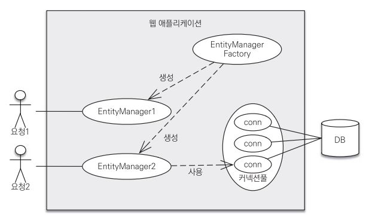

엔티티 매니저 팩토리는 다수의 엔티티 매니저를 생성함.

앤티티 매니저는 데이터 베이스 연결이 꼭 필요한 시점까지 커넥션을 얻지 않음. 그래서 트랜잭션을 시작할때 커넥션을 획득함.

하이버네이트를 포함한 JPA 구현체들은 엔티티 매니저 팩토리를 생성할때 커넥션 풀을 만듦.(persistence.xml에 DB 접속 정보가 적혀있음)

## 영속성 컨텍스트

엔티티를 영구 저장하는 환경. 엔티티 매니저로 엔티티를 저장하거나 조회하면 엔티티 매니저는 영속성 컨텍스트에 엔티티를 보관하고 관리함.

`em.persist(member);`

엔티티를 저장하는건 정확히 이야기하면 persist() 메소드는 엔티티 매니저를 사용해서 엔티티를 영속성 컨텍스트에 저장하고 말할 수 있음. 엔티티를 영속성 컨텍스트에 저장한것임.

영속성 컨텍스트는 논리적인 개념에 가깝고 엔티티 매니저를 생성할 때 하나 만들어진다.

엔티티 매니저를 통해 영속성 컨텍스트에 접근할 수 있고 관리할 수 있다. (여러 엔티티 매니저가 하나의 영속성 컨텍스트에 접근할 수도 있다.)


## 엔티티의 생명주기

엔티티에는 4가지 상태가 존재한다.

- 비영속(new/transient) : 영속성 컨텍스트와 전혀 관계가 없는 상태
- 영속(managed) : 영속성 컨텍스트에 저장된 상태
- 준영속(detached) : 영속성 컨텍스틍 저장되었다가 분리된 상태
- 삭제(removed) : 삭제된 상태


엔티티의 생명주기는 다음과 같다.

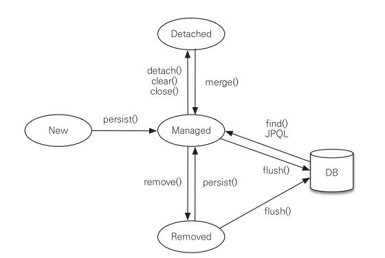

### 비영속

엔티티를 생성한후 순수한 객체 상태이며 아직 저장하지 않은 상태.

```sql
Member member = new Member();
member.setId("id1");
member.setUsername("member1")
```

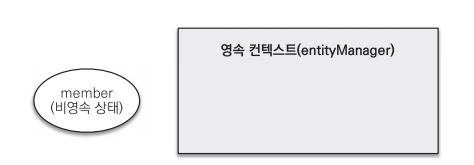

### 영속

엔티티 매니저를 통해 엔티티를 영속성 컨텍스트에 저장한 상태. 이를 영속 상태라고 부름. 영속 상태라는 말은 영속성 컨텍스트에 의해 관리된다는 말임.

`em.persist(member);`

em.find() 나 JPQL을 사용해서 조회한 엔티티도 영속성 컨텍스트가 관리하는 영속 상태임.

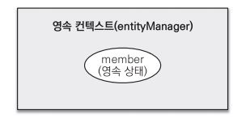

### 준영속

영속 상태의 엔티티를 영속성 엔티티가 관리하지 않으면 준영속 상태가 됨.

`em.detach(member);`

em.close (영속성 컨텍스트를 닫음), em.clear(영속성 컨텍스트를 초기화) 해도 준영속 상태가 됨.

### 삭제

엔티티를 영속성 컨텍스트와 데이터베이스에서 삭제.

`em.remove(member);`


## 영속성 컨텍스트의 특징

- 영속성 컨텍스트와 식별자 값

  영속성 컨텍스트는 엔티티를 식별자 값(@Id)으로 구분함. 영속 상태에서는 반드시 식별자 값이 있어야함.

- 영속성 컨텍스트와 데이터베이스 저장

  JPA는 트랜잭션을 커밋하는 순간 영속성 컨텍스트에 새로 저장된 엔티티를 데이터베이스에 반영함. 이를 **플러시**(flush)라고 함.

- 영속성 컨텍스트가 엔티티를 관리할때 장점

  - 1차 캐시
  - 동일성 보장
  - 트랜잭션을  지원하는 쓰기 지연
  - 변경 감지
  - 지연 로딩


### 엔티티 조회

영속성 컨텍스트틑 내부에 캐시를 가지고 있는데 이를 **1차 캐시**라고 함. 영속 상태의 엔티티는 모두 이곳에 저장됨. 비유하자면 영속성 컨텍스트 내부에 Map이 하나 있는데 키를 @Id로 매핑한 식별자고 값은 엔티티 인스턴스임.

```
Member member = new Member();
member.setId("member1");
member.setUsername("회원1");

em.persist(member);
```

이를 수행하면 다음과 같이 영속성 컨텍스트에 저장됨. (아직 DB에 저장된건 아님)

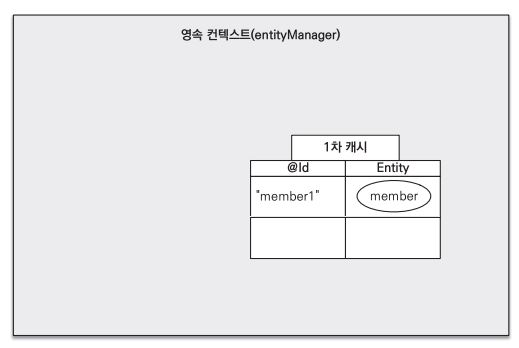

1차 캐시의 키는 식별자 값(@Id)이고 식별자 값은 DB 기본 키와 매핑되어 있음.

그래서 영속성 컨텍스트에 데이터를 저장하고 조회하는 기준은 DB의 기본 키 값임.

`Member member = em.find(Member.class,"member1")`

em.find()를 호출하면 1차 캐시에서 먼저 엔티티를 찾아보고 없으면 DB에서 조회함.

(find() 의 파라미터는 엔티티의 클래스 타입과 엔티티의 식별자임)


#### 1차 캐시에서 조회

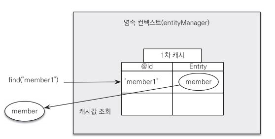

```
// 1차 캐시에 저장
em.persist(member);

// 1차 캐시에서 조회
Member findMember = em.find(Member.class,"member1");
```

식별자에 해당하는 엔티티가 1차 캐시에 있으면 1차 캐시에서 먼저 조회함.


#### 데이터베이스에서 조회


1차 캐시에 없으면 DB에서 조회함.

조회한 데이터로 엔티티를 생성해서 1차 캐시에 다시 저장(영속 상태)

그리고 조회한 엔티티를 반환.


#### 영속 엔티티의 동일성 보장

```
Member a = em.find(Member.class,"member1");
Member b = em.find(Member.class,"member1");

System.out.println( a == b ); // 동일성 비교 (주소까지 같아야함)
```

여러번 호출하여도 같은 1차 캐시에서 엔티티 인스턴스를 반환받기 때문에 a, b는 동일한 인스턴스이다.


영속성 컨텍스트는 1차 캐시를 통한 성능상 이점과 동일성을 보장해준다.


### 엔티티 등록

엔티티 매니저는 트랜잭션을 커밋하기 직전까지 DB에 엔티티를 저장하지않고 내부 쿼리 저장소에 INSERT SQL을 모아둔다. 그리고 커밋하는 순간 모아둔 쿼리를 DB에 내보내는데 이를 **트랜잭션을 지원하는 쓰기 지연**이라 한다.

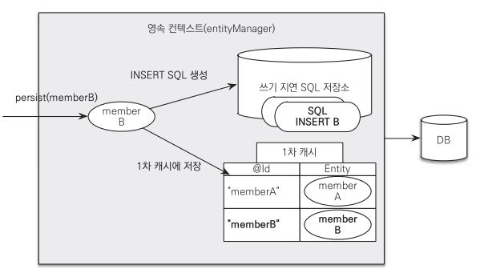

영속성 컨텍스트는 1차 캐시에 엔티티를 저장하면서 동시에 엔티티 정보로 등록 쿼리를 만든다.

이렇게 만들어진 등록 쿼리를 쓰기 지연 SQL 저장소에 보관한다.


트랜잭션을 커밋하면 엔티티 매니저는 영속성 컨텍스트를 플러시한다.(DB에 동기화하는 작업으로 엔티티 변경 내용이 DB에 반영된다. 구체적으로 쓰기 지연 SQL 저장소에 모인 쿼리를 DB에 내보낸다.) 

이렇게 영속성 컨텍스트의 변경 내용을 DB에 동기화한후 실제 DB 트랜잭션을 커밋한다.

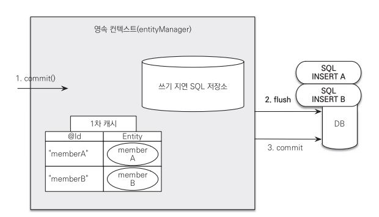


#### 트랜잭션을 지원하는 쓰기 지연이 가능한 이유

논리적으로 데이터를 저장하는 즉시 등록 쿼리를 바로 DB에 보낼수도 있고 등록 쿼리를 따로 메모리(쓰기 지연 SQL 저장소)에 저장했다가 커밋 직전에 한꺼번에 보낼수도 있다.(이것이 트랜잭션을 지원하는 쓰기 지연이 가능한 이유) 이 둘은 DB에서 커밋하기 직전이므로 결과는 완벽히 동일하다. 그러나 등록 쿼리를 모아서 보내면 성능상 이점이 있다.

### 엔티티 수정

#### 엔티티 수정의 문제점

엔티티 수정시 여러개의 속성중 일부만 수정하고 싶은 경우가 있는데 나머지 속성을 실수로 변경하지 않기 위해서 필요할때마다 여러번의 쿼리를 날린다. 이러한 문제점은 수정 쿼리가 많아지는것도 있고 비즈니스 로직을 분석하기 위해 SQL을 계속 확인해야한다. 비즈니스 로직이 SQL에 의존하게 되는것이다.


#### 변경 감지 (dirty checking) 

JPA는 엔티티를 수정할때 엔티티를 조회해서 데이터만 변경하지 그때마다 update 함수를 호출하지 않는다. 엔티티의 변경사항을 DB에 자동으로 변경하는 기능을 **변경 감지(dirty checking)**이라고 한다.

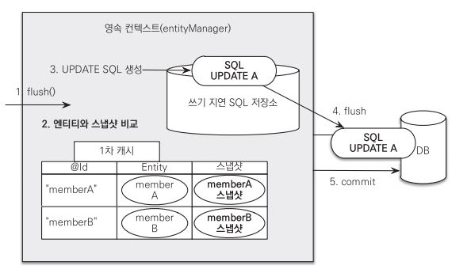

JPA는 엔티티를 영속성 컨텍스트에 저장할때 최초 상태를 복사해서 저장하는데 이를 스냅샷이라고함.

그리고 플러시 시점에 스냡샷과 엔티티를 비교해서 변경된 엔티티를 찾음.

트랜잭션을 커밋하면 엔티티 매니저 내부에서 플러시가 호출되고(1) 스냅샷과 엔티티를 비교해서(2) 엔티티가 변경되었으면 UPDATE SQL을 쓰기 지연 SQL 저장소 보냄(3). 그리고 쓰기 지연 SQL 저장소의 SQL을 DB로 보내고(4), DB 트랜잭션을 커밋함.

변경 감지는 영속 상태에 엔티티에만 해당됨(1차 캐시에 있어야하니)

JPA는 모든 필드를 이용해서 UPDATE문을 날린다.

그 이유는

- 모든 필드를 사용하면 수정 쿼리가 항상 같고 애플리케이션 로딩 시점에 수정 쿼리를 미리 생성해두고 재사용할 수 있다.
- DB에 동일한 쿼리를 보내면 DB는 이전에 한 번 파싱된 쿼리를 재사용할 수 있다.

필드가 많거나 내용이 너무 크면 수정 데이터만 동적으로 UPDATE 할 수도 있다.

`@org.hibernate.annotions.DynamicUpdate`

### 엔티티 삭제

`em.remove(member);`

엔티티 삭제도 즉시하는것이 아니라 삭제 쿼리를 쓰기 지연 SQL 저장소에 등록한다. 이후 트랜잭션을 커밋해서 플러시를 호출하면 그때 실제 DB에 삭제 쿼리를 전달한다.

remove()를 호출하는 순간 영속성 컨텍스트에서 제거되고 제거된 엔티티는 재사용하지말고 자연스럽게 GC의 대상이 되도록 두는것이 좋다.


## 플러시

플러시는 영속성 컨텍스트의 변경 내용을 DB에 반영한다.

플러시를 실행하면

변경 감지가 동작해 영속성 컨텍스트에서 엔티티와 스냅샷을 비교해 수정된 엔티티를 찾는다.

그리고 수정되면 쓰기 지연 SQL 저장소에 UPDATE문을 등록하고 등록된 쿼리들을 DB에 전송한다.


영속성 컨텍스트를 플러시하는 방법은 3가지다

- em.flush() 직접 호출
- 트랜잭션 커밋 시 플러시가 자동 호출
- JPQL 쿼리 실행 시 플러시가 자동 호출

#### 직접호출

flush()를 직접 호출해 영속성 컨텍스트를 강제로 플러시한다. 거의 사용 x

#### 트랜잭션 커밋 시 플러시 자동 호출

DB 변경 내용을 SQL로 전달하지 않고 트랜잭션만 커밋하면 아무런 데이터도 DB에 반영되지 않는다. 그래서 JPA는 트랜잭션 커밋 시 플러시를 자동으로 호출해 영속성 컨텍스트의 내용이 DB에 반영되도록 한다.

#### JPQL 쿼리 실행 시 플러시가 자동 호출

 em.persist(memberA) 로 영속성 컨텍스트에 저장하면 실제 DB에는 반영되기 전이다. 그러면 이때 JPQL로 DB 내용을 쿼리로 불러오면 memberA는 DB에 존재하지 않는다. 따라서 JPA는 JPQL을 실행하면 플러시를 시켜 모순을 없앤다.

### 플러시 모드 옵션

엔티티 매니저에 플러시 모드를 직접 지정하려면 javax.persistence.FlushModeType을 사용하면되는데

- FlushModeType.AUTO - 커밋이나 쿼리 실행시 플러시 (디폴트)
- FlushModeType.COMMIT - 커밋시에만 플러시

일반적으로는 AUTO로 두고 사용한다. 특수한 상황에서 성능 최적화할 때만 COMMIT을 쓴다.

플러시는 영속성 컨텍스트의 내용을 지우는것이 아닌 DB와 동기화하는것이다.

JPA는 DB와 동기화를 최대한 늦추는데 트랜잭션이라는 작업 단위가 있어 트랜잭션 커밋 직전에만 변경 내용을 DB에 반영하면 된다.


## 준영속

영소성 컨텍스트가 관리하는 영속 상태의 엔티티가 영속성 컨텍스트에서 분리(detached)된 상태를 준영속 상태라고 한다. 영속성 상태에서 벗어나있기 떄문에 영속성 컨텍스트의 기능은 사용할 수가 없어진다.

준영속 상태를 만드는 3가지 방법

1. em.detach(entity) : 특정 엔티티만 준영속 상태로 전환.
2. em.clear() : 영속성 컨텍스트를 완전히 초기화.
3. em.close() : 영속성 컨텍스트를 종료.


### detach()

detach()를 호출하면 해당 엔티티를 엔티티 컨텍스트에서 제거한다.

`em.detach(memeber);`


구체적으로 살펴보면 1차 캐시부터 쓰기 지연 SQL 저장소까지 해당 엔티티를 관리하는 모든 정보가 제거된다.

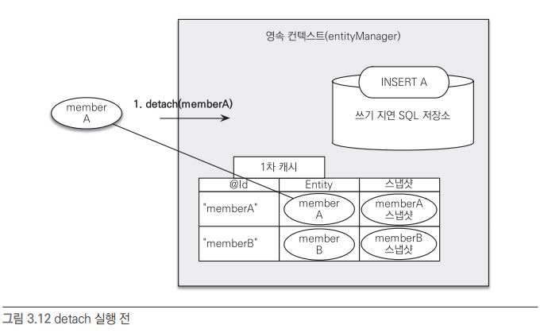

실행 전과 후를 비교해보면 memberA에 대한 정보가 삭제된걸 알수있다.


이렇게 영속성 컨텍스트에서 제거하면 당연히 DB에도 저장되지 않는다.

### clear()

detach()는 한 엔티티만 영속성 컨텍스트에서 제거했다면

clear()는 모든 엔티티를 제거한다.

`em.clear();`

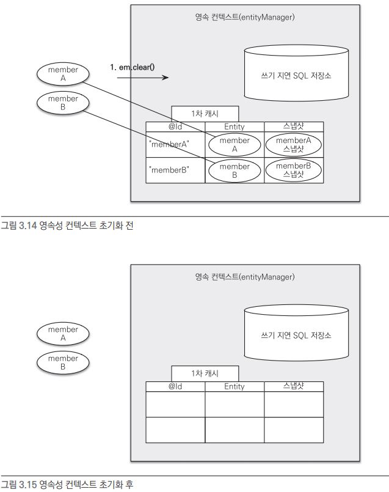

### close()

영속성 컨텍스트를 종료하면 clear()와 비슷하게 모든 영속성 컨텍스트의 내용을 준영속 상태로 만든다. 

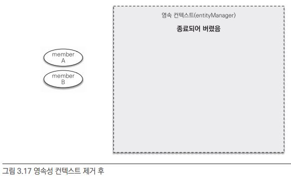

개발자가 직접 준영속 상태로 만들기보다는 영속성 컨텍스트를 종료시키면서 준영속 상태로 만드는게 일반적이다.


### 준영속 상태 특징

- 거의 비영속 상태에 가깝다.

  영속성 컨텍스트에서 관리하지 않기에 1차 캐시, 쓰기 지연, 변경 감지, 지연 로딩 같은 어떠한 기능도 사용할 수 없다.

- 식별자 값을 갖고 있다.

  비영속 상태는 식별자 값이 없을 수도 있지만, 준영속 상태는 한번 영속 상태를 가졌기 때문에 무조건 식별자 값을 가지고 있다.

- 지연 로딩을 할 수 없다.

  지연 로딩(LAZY LOADING)은 실체 객체를 프록시 객체에 로딩해두고 실제 객체를 사용할때 데이터를 불러오는 방식인데, 영속성 컨텍스트가 관리해주지 않으니 지연 로딩도 할 수 없다.

### 병합 : merge()

준영속 상태의 엔티티를 다시 영속 상태로 바꾸기 위해서는 merge() 메소드를 호출해야한다.

`Member mergeMember = em.merge(member);`

그러면 mergeMember라는 새로운 영속 상태의 엔티티가 생긴다.

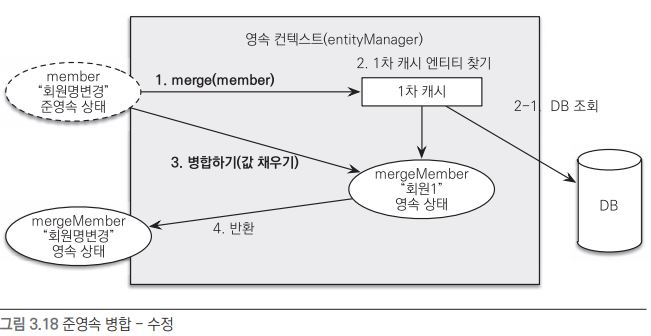

merge() 메소드를 실행하면 1차캐시에서 해당 엔티티가 존재하는지 확인하고 없으면 DB를 조회해서 1차 캐시에 저장한다. 그리고 매개변수로 넣어준 엔티티의 값으로 엔티티 값을 변경해주고 새로운 엔티티를 반환해준다.

그래서 merge()할떄는 일반적으로 덮어씌워준다.

`member = em.merge(member);`

#### 비영속도 가능(save or update)

merge는 비영속 상태라도 가능하다.

엔티티으 식별자 값으로 영속성 컨텍스트를 조회하고 1차 캐시에 없으면 DB한다. 그때도 없으면 새롭게 엔티티를 생성해서 병합한다. (save or update 기능을 한다.)

